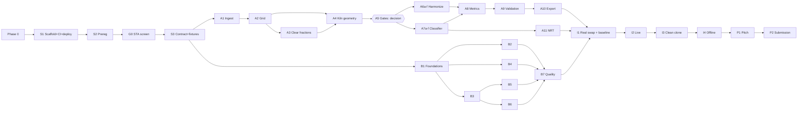

# Kiln Watch: Implementation Plan

> **Post-build note (6 Oct 2026).** This document is a pre-build planning artifact (prior-work disclosure); its content is unchanged. In the built repository, `reports/` lives at `docs/reports/`, pitch material at `docs/presentation/`, and governance files (`PREREGISTRATION.md`, `CLAUDE.md`, `VERIFICATION.md`, `BLOCKERS.md`) in `docs/`. Path references below (e.g. `reports/baseline.json`) resolve to their `docs/` locations. See `file_structure.md` v3.1 for the as-built tree.

**Challenge:** NASA Space Apps 2026, *Harmonization of MODIS and VIIRS Hot Spots*
**Plan version:** v2.1 (final) — 6 October 2026. Supersedes v2.0, v1.0 and planning plan v3.0. Closes every finding in `Implementation_Plan_v1_Audit.txt` (18 findings) and `Kiln_Watch_Implementation_Plan_Improvements.txt` (27 findings). **v2.1** closes two gaps found while syncing `architecture.md` and `file_structure.md`: the primary-inventory rule referred to the gate season while the gate season was derived from the inventory (§12), and the deploy job had no source for the real public export once `web/public/data/` became gitignored (§2, §7.1, §9, §11).
**Status:** Buildable once **Phase 0** (§17) is complete. Phase 0 is blocking by design.
**Scheduling:** deliberately omitted. Steps are ordered by dependency only; there are no dates or effort estimates. The one scope contingency that remains is §14's **Event-only tier**, which is a tier, not a schedule.
**Companion docs:** `architecture.md` · `file_structure.md` · `CLAUDE.md` (§16) · `PREREGISTRATION.md` (§12) · `VERIFICATION.md` · `BLOCKERS.md`

> **Two verification kinds, and they are not interchangeable.**
> **VERIFY-A** — automated, exits non-zero on failure, runs in CI. Uses **synthetic data only**.
> **VERIFY-S** — stage assertion, runs inside the pipeline stage against **real data**, fails the stage.
> **VERIFY-H** — human, a row in `VERIFICATION.md` signed and dated by a person. An agent may never tick one.
> A step is done when VERIFY-A and VERIFY-S pass and its VERIFY-H rows are signed.

---

## 1. Requirements and definition of done

### 1.1 What we build

A static web application backed by an offline Python pipeline:

1. It **harmonizes** the MODIS (2003–) and VIIRS (2012–) active-fire records for Bangladesh into one consistent burning-activity calendar with uncertainty bands.
2. It **separates** each detection into kiln-like, vegetation-like or unknown heat.
3. It **shows** history, the normal range, unusual days, critical periods and the current season for any district, upazila or drawn box.

Site-level kiln data never goes public. It exists only as an offline regulator export.

### 1.2 Functional requirements

| # | Requirement | Delivered by |
|---|---|---|
| FR1 | Harmonize MODIS and VIIRS | `harmonize.py`; raw/harmonized toggle; `JumpChart` |
| FR2 | Burning activity calendar | `CalendarHeatmap` (year × day) |
| FR3 | Historical fire patterns | `metrics.season_metrics`; `SeasonMetricsTable` |
| FR4 | Unusual conditions | `metrics.flags`; `NormalBandChart` markers |
| FR5 | Critical periods | `metrics.flags`; `NormalBandChart` shading |
| FR6 | Early warning / current season | `nrt.py`; `ThisSeasonPage` |
| FR7 | Selected area of interest | `UnitSearch`, map click, `BoxDrawLayer` |
| FR8 | Source separation (our addition) | `classify.py`; `SourceStackChart` |
| FR9 | Scientific evidence visible to users | `gates.py`, `validate.py`; `EvidencePage` |
| FR10 | Downloads | `DownloadButtons` (CSV/JSON) |
| FR11 | Restricted regulator output | `export.write_regulator` (offline) |

**Users:** DoE enforcement (regulator export), air-quality researchers (calendars, downloads), fire-data users and land managers (harmonized calendar), early-warning responders (this-season view), journalists and NGOs (district view, Bangla).

### 1.3 Non-functional requirements

| # | Requirement | Target |
|---|---|---|
| NFR1 | No server at runtime | Static files on GitHub Pages only |
| NFR2 | Load speed | Story first paint < 1.5 s on 4G; initial payload < 1.5 MB gz |
| NFR3 | Works offline | `vite preview` of `web/dist` with network off (basemap is the only casualty) |
| NFR4 | Reproducible | Clean clone → documented downloads → `python -m kilnwatch all` → `npm run build` reproduces `reports/baseline.json` |
| NFR5 | Deep-linkable | Every view restorable from its URL; unknown params degrade gracefully |
| NFR6 | Accessible | Keyboard path for every action, text summary per chart, colour-blind-safe palette + decals |
| NFR7 | Privacy / ethics | No kiln ids, cluster ids, candidate flags or kiln coordinates in public files — enforced by name check, **value check**, unit test and CI |
| NFR8 | Honest statistics | Pre-registered gates; every published number carries a 95% interval |
| NFR9 | Determinism | Two consecutive runs produce byte-identical `harm_draws.parquet` and `labels.parquet` |
| NFR10 | **Test isolation** | **No test under `tests/` or `web/src/**` may read `data/raw`, `data/interim` or `data/raw/gee`. Real-data checks are VERIFY-S, inside the stage.** |

### 1.4 Definition of done

- [ ] Every FR visible on the deployed site, or available offline for FR11.
- [ ] `reports/gate_report.md` evaluates every §12 rule; `config.GATE_BRANCH` committed.
- [ ] **Pooled leave-one-season-out** 95% coverage is 0.90–0.97, reported with its binomial CI.
- [ ] The **seam criterion** passes as a stage assertion (A6e) and the seam statistic passes its unit test on synthetic data.
- [ ] Classifier PR-AUC beats prevalence and the rule baseline under **spatial, temporal and cross-sensor** holdouts, or the rule baseline ships and this is stated.
- [ ] `validation.json` holds layers 1, 3 and 4 at minimum, under the active branch's definitions.
- [ ] NRT workflow green on 3 consecutive scheduled runs.
- [ ] All VERIFY-A green in CI; all VERIFY-S green on the real run; name check and value check pass; budgets met.
- [ ] `reports/baseline.json` exists; I3 reproduces it.
- [ ] **Every VERIFY-H row in `VERIFICATION.md` signed and dated.**
- [ ] **P1 complete:** pitch rehearsed four times, both money-shot PNGs exist and work offline, and a person who has not seen the project restates the headline finding correctly after one viewing.
- [ ] **P2 complete:** project submitted, every required field populated, every link resolving from a logged-out browser, confirmation screenshot in `VERIFICATION.md`.

---

## 2. Decisions

| Decision | Choice |
|---|---|
| Architecture | Python batch pipeline → static JSON → React SPA on GitHub Pages; daily NRT via GitHub Action |
| Core vs application | Harmonization is the core; kilns are the local application |
| Frontend | React 19 + TypeScript + Vite; Tailwind CSS v4; react-leaflet; Apache ECharts |
| Raster processing | Google Earth Engine, used for **clear fractions only**, never absolute counts |
| Grid addressing | Regional grid covering Bangladesh **and** the IGP transfer region, bounds-asserted, constants published in `meta.json` as the single source of truth |
| Calibration unit | **Season years (1 Jul – 30 Jun)** throughout. Leave-one-**season**-out. |
| Classifier labels | Kiln footprint + season (primary); MODIS `type=2` as a **separately reported** augmentation |
| Regulator tier | Offline export, never hosted |
| VIIRS Nightfire | Parallel gate (GN) only |
| Geography | Bangladesh (Must) plus one IGP transfer district (**Should**, with its own boundaries and denominators) |
| Data contract | Branch-agnostic `split[]`; gate outcome requires no contract change |
| Fixtures vs real data | Separate directories. `web/fixtures/<branch>/data/` committed; `web/public/data/` generated and gitignored. Vite's `publicDir` is chosen by `DATA_SRC`, so nothing is copied and fixtures can never overwrite real data |
| Real public data delivery | `export --publish` runs both safety checks and uploads `public-data.tar.gz` to the GitHub Release `data-current` (plus an immutable `data-<short_sha>`). CI downloads it. **The real public export never enters git history** |
| Scope contingency | §14 **Event-only tier**, selected if Phase 0.1 disallows substantial prior work |

---

## 3. Tech stack

| Layer | Technology | Why |
|---|---|---|
| Pipeline | Python 3.11 | GeoPandas, scikit-learn, Earth Engine SDK |
| Tabular | pandas 2 + NumPy 2 + PyArrow | ~2M detections fit in memory; typed interim tables |
| Spatial | GeoPandas 1 + Shapely 2 + pyogrio | Joins, buffers, GeoJSON; metric work in EPSG:3106 |
| Raster / cloud | Google Earth Engine Python API | Daily fire masks, TROPOMI, WorldCover, ERA5 with no downloads |
| Granule fallback | `earthaccess` | VJ114A1 / VJ214A1, not on GEE |
| ML / stats | scikit-learn, SciPy | DBSCAN, BallTree, HistGradientBoosting, PoissonRegressor, Mann–Whitney |
| Figures | Matplotlib | Report evidence, offline backups, P1 money-shot stills |
| HTTP | `requests` + `urllib3.Retry` | FIRMS, OpenAQ, HDX, EOG |
| Orchestration | `python -m kilnwatch <stage>` | One command per stage plus `all` |
| Frontend | React 19 + TypeScript 5 | Components, typed contracts |
| Build | Vite | Static `dist/`, `base` for Pages |
| Styling | Tailwind CSS v4 (`@theme`) | One palette shared by UI and charts |
| Routing | react-router 7 (`HashRouter`) | Deep links on Pages without 404 rewrites |
| Map | Leaflet 1.9 + react-leaflet 5 | Light, no token |
| Charts | Apache ECharts (`echarts/core`) | Heatmap, bands, markArea, ARIA, decals |
| Hosting / CI | GitHub Pages + Actions | Static, free, zero cold start |
| Quality | Ruff + pytest; ESLint + Vitest; one Playwright smoke test | One tool per job |

**Rejected:** FastAPI/Render backend (cold starts); Streamlit (server, weak UI); XGBoost (HistGradientBoosting is the same family); leaflet-draw (~30 lines); component kits; D3; notebooks as the pipeline.

---

## 4. Libraries

Floors below; exact pins from `pip freeze` and `package-lock.json` at S1.

**Python:** pandas 2.2, numpy 2.0, pyarrow 17, geopandas 1.0, shapely 2.0, pyogrio 0.9, scipy 1.13, scikit-learn 1.5, joblib, matplotlib 3.9, earthengine-api 1.0, earthaccess 0.11, requests 2.32, python-dotenv 1.0, pytest 8, ruff 0.6.

**Frontend:** react, react-dom, react-router, leaflet, react-leaflet, echarts; dev: vite, @vitejs/plugin-react, tailwindcss, @tailwindcss/vite, typescript, @types/*, eslint stack, vitest, @playwright/test.

**Platform features instead of libraries:** `<input list>`+`<datalist>`; `Intl.NumberFormat('bn-BD')`; `Blob`+`<a download>`; `AbortController`; `ResizeObserver`.

---

## 5. External APIs and data services

| Service | Access | Auth | Limits | Handling |
|---|---|---|---|---|
| **FIRMS Area API** | `GET /api/area/csv/{KEY}/{SOURCE}/{W,S,E,N}/{DAY_RANGE}/{YYYY-MM-DD}` | `FIRMS_MAP_KEY` | **DAY_RANGE 1–5**; **5,000 transactions / 10 min** | Cache per (source, start); retry ×3 backoff on 429/5xx; quota via `mapserver/mapkey_status/` |
| FIRMS sources | `MODIS_SP`, `MODIS_NRT`, `VIIRS_SNPP_SP`, `VIIRS_SNPP_NRT`, `VIIRS_NOAA20_SP`, `VIIRS_NOAA20_NRT`, `VIIRS_NOAA21_NRT` | — | NOAA-21 is **NRT only** | S-NPP returns empty after **2 Nov 2026 1300 UTC** — empty is not an error |
| **FIRMS data availability** | `GET /api/data_availability/` | `FIRMS_MAP_KEY` | — | **A1a** reads exact per-sensor start dates from here and asserts them against `config` |
| **FIRMS Archive Download** | Web form | Earthdata login | Email delivery | `load_firms_archive`; API SP backfill is the fallback |
| **Google Earth Engine** | `ee.data.computeFeatures(..., 'PANDAS_DATAFRAME')` | `earthengine authenticate` | ~5 min interactive timeout | Monthly chunks, Parquet cache per (dataset, unit-set, sensor, month), resumable, `Export.table.toDrive` fallback |
| GEE assets | `MODIS/061/MOD14A1`, `MODIS/061/MYD14A1`, `NASA/VIIRS/002/VNP14A1` (`FireMask`, `QA`); `ESA/WorldCover/v200`; `COPERNICUS/S5P/OFFL/L3_NO2`, `L3_SO2`; `ECMWF/ERA5_LAND/DAILY_AGGR`; `COPERNICUS/S2_SR_HARMONIZED` | — | — | Band names verified in A3a |
| **NASA Earthdata** | `earthaccess` VJ114A1 / VJ214A1 | `~/.netrc` | — | Bangladesh tiles only |
| **OpenAQ v3** | `/v3/locations`, `/v3/sensors/{id}/days` | `X-API-Key` | Read `x-ratelimit-*`; throttle 1 rps | One JSON per sensor-year |
| **EOG VIIRS Nightfire** | EOG site, OpenID flow | `EOG_USER`/`EOG_PASSWORD` | — | Manual download acceptable |
| **HDX (CKAN)** | `package_show?id=cod-ab-bgd` | None | — | Bangladesh boundaries |
| **Transfer-region boundary** | GADM, that country's HDX COD, or its statistics office | None | — | **Required for the Should-tier transfer test; licence recorded** |
| **APAD (AWS Open Data)** | Anonymous S3 | None | — | **CC BY 4.0 — attribution required** |
| **SentinelKilnDB** | HuggingFace | None | — | **CC BY-NC 4.0 — non-commercial. Validation only; never primary (§12)** |
| **Geofabrik** | `bangladesh-latest-free.shp.zip` | None | — | Could tier |
| **Basemap** | CARTO Positron tiles | None | Fair use | Degrades to polygons offline |

**Env vars** (`.env` gitignored; `.env.example` committed): `FIRMS_MAP_KEY`, `OPENAQ_API_KEY`, `EE_PROJECT`, `EOG_USER`, `EOG_PASSWORD`. Earthdata uses `~/.netrc`. CI receives only `FIRMS_MAP_KEY`.

---

## 6. `config.py` — every constant typed as PRE-REGISTERED or DERIVED

**Truth direction.** A **PRE-REGISTERED** constant's truth lives in `PREREGISTRATION.md`; `config` copies it and `tests/test_config.py` asserts equality. A **DERIVED** constant's truth is produced by a named step; that step writes it, with its source and date, to **`kilnwatch/config_derived.json`** (committed), which `config.py` loads, and asserts it against the source. A **FIXED** constant is an engineering choice, changeable by ordinary review.

| Constant | Kind | Value / source |
|---|---|---|
| `GRID_ORIGIN_LAT` | FIXED | `20.0` |
| `GRID_ORIGIN_LON` | FIXED | `68.0` (west enough for the IGP transfer region) |
| `GRID_STEP` | FIXED | `0.01` |
| `GRID_ROWS` | FIXED | `1500` → 20.0–35.0 N |
| `GRID_COLS` | FIXED | `3000` → 68.0–98.0 E |
| `BBOX_W,S,E,N` | FIXED | `88.0, 20.5, 92.8, 26.7` (Bangladesh analysis extent) |
| `METRIC_CRS` | FIXED | `"EPSG:3106"` |
| `SENSORS` | FIXED | `{"T":"Terra","A":"Aqua","N":"S-NPP","J1":"NOAA-20","J2":"NOAA-21"}` |
| `SEASON_YEAR_START` | FIXED | `(7, 1)` — 1 July |
| `FIRING_MONTHS` | PRE-REGISTERED | `(11,12,1,2,3,4,5)` |
| `MONSOON_MONTHS` | PRE-REGISTERED | `(6,7,8,9,10)` |
| `GATE_SEASON` | PRE-REGISTERED (by rule) | §12 season-selection rule, applied after Phase 0.2 |
| `CONF_KEEP` | PRE-REGISTERED | `("nominal","high")` |
| `CALIB_SEASONS` | **DERIVED in A1a** | Expected `("2012-13" … "2020-21")`, nine seasons. Lower bound: the first **complete** firing season after the VIIRS 375 m record begins (**20 January 2012**, so 2011-12 is excluded). Upper bound: the last firing season wholly before Aqua's orbital drift (drift from Jan 2022, so 2021-22 is excluded). A1a reads the archive start from `/api/data_availability/` and **asserts** the committed tuple. |
| `MIN_SNPP_CELLDAYS` | PRE-REGISTERED | `100` — primary sufficiency criterion per stratum |
| `MIN_PAIRED_DAYS` | PRE-REGISTERED | `10` — secondary; prevents one busy day carrying a stratum |
| `LOSO_COVERAGE_TARGET` | PRE-REGISTERED | `(0.90, 0.97)`, applied to **pooled** coverage only |
| `SEAM_RATIO_MAX` | PRE-REGISTERED | `0.25` |
| `DBSCAN_EPS_M` | **DERIVED in A4a** | Median VIIRS S-NPP pixel half-diagonal over Bangladesh; written with a source note |
| `MAX_CLUSTER_DIAM_M` | FIXED | `5_000` |
| `MAX_CLUSTER_SHARE` | FIXED | `0.02` |
| `CONTROL_ATTEMPTS_MAX` | FIXED | `2_000` per control |
| `CONTROL_DROP_MAX` | PRE-REGISTERED | `0.20` national |
| `CONTROL_DROP_MAX_DIV` | PRE-REGISTERED | `0.40` per division |
| `WATER_CHECK_UNIT` | **DERIVED in A3a** | The upazila chosen for the water assertion, plus its WorldCover permanent-water fraction and the computation date |
| `SEED` | FIXED | `20261114` |
| `SEED_OFFSETS` | FIXED | `{"kilns":1,"gates":2,"harmonize":3,"classify":4,"metrics":5,"validate":6}` |
| `GATE_BRANCH` | **DERIVED in A5** | `"full" \| "from2012" \| "partial" \| "nightfire" \| "nokiln"` |
| `FORBIDDEN_PUBLIC_KEYS` | FIXED | `{"kiln_id","cluster_id","candidate","kiln_lat","kiln_lon"}` |
| `WEB_DATA`, `WEB_FIXT`, `REGULATOR_DIR` | FIXED | `web/public/data` (generated) · `web/fixtures` (committed) · `regulator` (never committed) |

**No bare coordinate tuples anywhere.** Every function taking a coordinate pair names its arguments `lat` and `lon`.

---

## 7. Internal interfaces

### 7.1 CLI

```
python -m kilnwatch ingest     [--only firms|inventories|boundaries|openaq|nightfire|osm]
python -m kilnwatch gee        [--dataset clear|worldcover|s5p|era5] [--units admin|footprints|transfer] [--sensor T|A|N|J1|J2] [--from YYYY-MM]
python -m kilnwatch grid
python -m kilnwatch kilns
python -m kilnwatch gates      [--gate G0|G1|G2|G3|GN]
python -m kilnwatch harmonize
python -m kilnwatch classify   [--transfer DISTRICT]
python -m kilnwatch metrics
python -m kilnwatch validate   [--only shape|s2chips|s2score|tropomi|pm25|closure]
python -m kilnwatch export     [--regulator] [--fixtures] [--check-public DIR] [--publish] [--downscale none|upazila2012|upazilaweekly]
python -m kilnwatch nrt        [--days 5]
python -m kilnwatch all
```

`gee` runs separately (slow, resumable). **`all` fails fast** with a named error if `data/raw/gee/` or `interim/clear.parquet` is missing; it may never proceed with a partial denominator. Every stage logs row counts and writes atomically (`*.tmp` then rename).

### 7.2 Module APIs

```python
# grid.py
def cell_id(lat: np.ndarray, lon: np.ndarray) -> np.ndarray
    """row = floor((lat-GRID_ORIGIN_LAT)/GRID_STEP + 1e-9)
       col = floor((lon-GRID_ORIGIN_LON)/GRID_STEP + 1e-9)
       RAISES ValueError if row or col is outside [0, GRID_ROWS/COLS).
       Returns row * GRID_COLS + col.  Max id 4_499_999."""
def cell_center(cid) -> tuple[np.ndarray, np.ndarray]
def pixel_radius_m(scan_km, track_km) -> np.ndarray          # 500*sqrt(scan^2+track^2)
def to_celldays(det) -> pd.DataFrame                          # cell_id, date_local, sensor, pass, n_det
def unit_cells(units) -> pd.DataFrame                         # unit_id, cell_id
def unit_rates(celldays, unit_cells, clear_frac, total_cells_local, min_clear=0.2) -> pd.DataFrame
    """clear_cells = clear_frac * total_cells_local.
       NaN (not observed) when clear_frac < min_clear."""
def season_of(date) -> str                                    # "2018-19" for 1 Jul 2018 – 30 Jun 2019

# gee.py
def daily_clear_fraction(sensor, units, month) -> pd.DataFrame # unit_id, date, clear_frac
    """FireMask remap [5,7,8,9]->1 else 0.  Water(3), cloud(4), unknown(6) and
       not-processed(1,2) are EXCLUDED.  Returns a FRACTION, never a count."""
def water_fraction(units) -> pd.Series                        # WorldCover permanent water, for A3a
def worldcover_at_points(points) -> pd.Series
def s5p_monthly(polys, gas) -> pd.DataFrame
def era5_daily(lat, lon, start, end) -> pd.DataFrame

# kilns.py
def reconcile(inv, radius_m=150) -> tuple[gpd.GeoDataFrame, pd.DataFrame]
def measure_eps(viirs) -> float
def cluster(kilns, eps_m, max_diam_m=MAX_CLUSTER_DIAM_M) -> tuple[gpd.GeoDataFrame, gpd.GeoDataFrame]
def sample_controls(clusters, kilns, districts, divisions, n=3, rng=...) -> gpd.GeoDataFrame
def link(det, units, radius: Literal["pixel"] | float) -> pd.DataFrame

# stats.py
def bootstrap_ci(x, stat, n=1000, block=None, rng=...) -> tuple[float,float,float]
def perm_test(values, is_kiln, strata, stat, n=10_000, rng=...) -> float
def wilson(k: int, n: int) -> tuple[float,float]
def chow_test(series, break_index) -> float

# harmonize.py
def pair_days(rates, a, b, seasons=CALIB_SEASONS) -> pd.DataFrame
def pool_key(stratum, rung: int) -> tuple | None              # None at rung 5 for night outputs
def fit_ratio(pairs) -> pd.DataFrame                          # beta, rung_used, n_celldays, n_days
def fit_glm(pairs) -> PoissonRegressor                        # alpha=0.0 explicitly
def loso(pairs, model) -> pd.DataFrame                        # leave-one-SEASON-out
def bootstrap_betas(pairs, n=1000, rng=...) -> pd.DataFrame   # resamples SEASONS
def to_myd_eq(rates, draws) -> pd.DataFrame                   # p2.5, p50, p97.5
def seam_stat(raw, harm, break_season="2011-12") -> dict      # d_raw, d_harm, ratio, chow_p_raw, chow_p_harm
def sp_nrt_ratio(j1_sp, j1_nrt) -> tuple[float,float,float]   # de-confounds beta3

# classify.py
FEATURES = ["bt_mir","bt_tir","bt_diff","frp","is_night","scan","track",
            "local_hour","conf_rank","p5","p30","iso1"]
def weak_labels(viirs, links, use_type2: bool) -> tuple[pd.Series, pd.Series]
def build_features(viirs) -> pd.DataFrame                     # past-only windows
def train(X, y, w, groups, rng=...) -> tuple[HistGradientBoostingClassifier, dict]
def holdout_spatial(...) -> dict
def holdout_temporal(...) -> dict
def holdout_cross_sensor(train_sensor, test_sensor) -> dict    # N->J1, and J1->J2
def ablate_persistence(...) -> dict
def choose_thresholds(p, y, precision=0.8) -> tuple[float,float]
def candidates(labels, kilns) -> gpd.GeoDataFrame
def transfer_test(district) -> dict

# metrics.py
def season_metrics(series) -> pd.DataFrame      # midpoint, duration, peak (+CI), first, last (flagged)
def normals(series, ref=("2003-04","2024-25")) -> pd.DataFrame
def flags(series, normal) -> tuple[list[int], list[tuple[int,int]]]
def activity_index(series, monsoon_null, branch) -> pd.DataFrame
    """branch in {full, from2012, partial, nightfire}: kiln-like minus monsoon null (HKFI).
       branch == 'nokiln': TOTAL harmonized burning minus monsoon null (HBI)."""
def clear_climatology(clear) -> pd.DataFrame
def emissions_estimate(series, factors) -> dict               # Could tier

# export.py
def write_public(out=WEB_DATA) -> None
def write_regulator(out=REGULATOR_DIR) -> None                # refuses any path inside web/
def write_fixtures(out=WEB_FIXT) -> None                      # one set per gate_branch
def assert_public_safe(obj) -> None                           # name-level
def check_public_dir(path: Path) -> None                      # value-level; see §9
def publish() -> None
    """Runs assert_public_safe and check_public_dir on WEB_DATA, packages it
       (excluding nrt/) as public-data.tar.gz, uploads it with --clobber to the
       'data-current' GitHub Release, and creates an immutable 'data-<short_sha>'
       release. Refuses to upload if either check fails."""
```

### 7.3 Static data contract — frozen at the end of S3

`web/src/lib/types.ts` is the contract.

```ts
export type Sensor = 'T' | 'A' | 'N' | 'J1' | 'J2';
export type Pass = 'D' | 'N';
export interface CI { p50: number; lo: number; hi: number }

export interface Meta {
  generated_at: string; git_sha: string; prereg_sha: string;
  params: Record<string, number | string>;
  data_versions: Record<string, string>;
  credits: { name: string; url: string; licence: string }[];
  non_claims: { en: string; bn: string }[];
  gate_branch: 'full' | 'from2012' | 'partial' | 'nightfire' | 'nokiln';
  split_labels: { key: string; label_en: string; label_bn: string }[];
  activity_index: { key: 'HKFI' | 'HBI'; label_en: string; label_bn: string };
  grid: { origin_lat: number; origin_lon: number; step: number; rows: number; cols: number };
}

export interface UnitProps {
  unit_id: string; level: 'district' | 'upazila' | 'transfer';
  name_en: string; name_bn: string; division: string;
  kiln_count: number | null; kiln_share: number | null;
}

export interface Calendar {
  unit_id: string; day0: '2003-01-01';
  days: number[];
  raw: Partial<Record<Sensor, number[]>>;
  h: number[];
  split: { key: string; values: number[] }[];
  index?: number[];                                    // HKFI or HBI per meta.activity_index
  nodata: [number, number][];
  clear_frac?: Partial<Record<Sensor, number[]>>;      // districts only, dense, 0–100 ints
  week0: string; h_lo: number[]; h_hi: number[];
  normal: { p10: number[]; p50: number[]; p90: number[] };
  unusual: number[]; critical: [number, number][];
  seasons: { season: string; midpoint: CI; duration: CI; peak: CI; first?: string; last?: string }[];
}

export interface Harmonization {
  selected_model: 'M0' | 'M1';
  yearly: { season: string; raw_sum: number; raw_by_sensor: Partial<Record<Sensor, number>>;
            h: CI; aqua_obs: number | null }[];
  betas: { step: 'A<-N' | 'N<-J1' | 'J1<-J2'; division: string; month: number; pass: Pass;
           loc: 'kiln' | 'other'; beta: CI; rung_used: number;
           n_celldays: number; n_days: number }[];
  loso_by_season: { season: string; model: 'M0'|'M1'; mae: number; bias: number; covered: number }[];
  loso_pooled: { model: 'M0'|'M1'; n: number; covered: CI };          // the gated figure
  seam: { d_raw: number; d_harm: number; ratio: number; chow_p_raw: number; chow_p_harm: number };
  sp_nrt_ratio?: CI;
}

export interface Validation {
  gates: { gate: 'G0'|'G1'|'G2'|'G3'|'GN'; criterion: string; value: number;
           threshold: string; p?: number; pass?: boolean }[];
  profiles: { week: string[]; kiln_day: number[]; kiln_night: number[];
              ctrl_day: number[]; ctrl_night: number[] };
  radius_sweep: { radius_m: number; kiln: number; ctrl: number }[];
  classifier: { pr_curve: [number, number][]; pr_auc: CI; baseline_pr_auc: number; prevalence: number;
                importance: { feature: string; value: number }[];
                holdouts: { kind: 'spatial'|'temporal'|'cross_sensor_N_J1'|'cross_sensor_J1_J2'; pr_auc: CI }[];
                labelset: { kind: 'footprint_only'|'with_type2'; pr_auc: CI }[];
                ablation_no_persistence?: CI };
  controls: { dropped_frac: number; by_division: Record<string, number>;
              rung_counts: Record<string, number> };
  candidates: { n: number; precision_skdb?: CI; precision_s2?: CI; kappa?: number;
                by_district: Record<string, number> };
  tropomi?: { treatment: 'HKFI' | 'HBI'; did_no2: CI; did_so2?: CI;
              monthly: { month: string; belt_minus_ring: number; index: number }[] };
  pm25?: { lag: number; r_kiln: CI; r_veg: CI }[];
  transfer?: { district: string; dr_computed: boolean; pr_auc: CI; gate_pass: boolean };
  closure_cases?: { title: string; before_dr: number; after_dr: number; note: string }[];
  skipped?: { stage: string; reason: string }[];
}

export interface Events { policy: { date: string; label_en: string; label_bn: string; url: string }[];
                          harvest: { crop: string; start_doy: number; end_doy: number; url: string }[] }

export interface NrtSeason { updated_at: string; provisional: true; season: string; day0: string;
  national: { h: number[]; split: { key: string; values: number[] }[] };
  districts: Record<string, { h: number[]; above_p90_days: number }> }

export interface GridTile { tile: string; day0: string;
  rows: [cell: number, day: number, sensorPass: number][] }
```

**Budgets:** `meta`/`events` < 50 KB · `harmonization` < 200 KB · `validation` < 500 KB · `aoi/districts.geojson` < 400 KB · `aoi/upazilas.geojson` < 1.5 MB · `calendar/{unit}.json` < 150 KB gz · `grid/{tile}.json` < 1 MB gz · `nrt/current_season.json` < 300 KB.

**Overflow is a flag, not prose.** If the total exceeds 100 MB, A10 fails and names `--downscale upazila2012` then `--downscale upazilaweekly`.

---

## 8. Frontend design

### 8.1 Routes (`HashRouter`)

| Route | Page |
|---|---|
| `#/` | `StoryPage` |
| `#/explore` · `#/explore/:level/:unitId` · `#/explore/box/:w,:s,:e,:n` | `ExplorerPage` |
| `#/kilns` · `#/kilns/:unitId` | `KilnSeasonsPage` (lazy) |
| `#/season` | `ThisSeasonPage` |
| `#/evidence` | `EvidencePage` (lazy) |
| `#/method` | `MethodPage` |

Search params: `?mode=raw|harm&layout=cal|season&season=2024-25&lang=en|bn&split=all|<key>`.

**Box URL canonical format.** `#/explore/box/{w},{s},{e},{n}`, each **fixed 4 decimal places**, W,S,E,N order, requiring `w < e`, `s < n`, all inside `BBOX_*`, and area ≥ 100 km². The parser rejects anything else and renders a `StatusMessage`. Example `box/90.2500,23.6000,90.6000,23.9000`.

**Unknown `split` key falls back to `all`** with a `StatusMessage`, so a link shared under one branch still opens after a rebuild under another.

### 8.2 Components

Tree and specs as architecture.md, with:

- `SourceStackChart` renders `cal.split[]` against `meta.split_labels`. **No branch special-casing anywhere in the UI.**
- `theme.ts` `palette()` carries **literal fallback colours**; `cssVar()` returns the fallback when `getComputedStyle` yields `''`.
- `box.ts` reads the grid from `meta.grid`. **No grid literals in TypeScript.**
- `LosoTable` shows per-season rows and marks the **pooled** figure as the gated one.
- `EvidencePage` adds `SeamCard`, `HoldoutTable` (four holdouts), `LabelsetCard`, `ControlsCard`, `TransferCard`.

### 8.3 Styling, accessibility, performance, offline

Tailwind `@theme` holds the palette (`--color-split-1..n`, `--color-raw`, `--color-harm`, `--color-band`, surfaces, text), system font stack (covers Bangla), radii. `vite.config.ts`: `base: '/<repo>/'`, plugins `react()`, `tailwindcss()`. Story loads React + ECharts core + two JSON files; Leaflet, Evidence and Kiln-seasons are lazy chunks. CI prints the bundle size.

---

## 9. CI/CD

**`ci.yml`** on every push and PR:

| Job | Steps |
|---|---|
| `python` | setup-python 3.11 → install → `ruff check .` → `pytest -q` (**synthetic only; NFR10 enforced by a test that fails if any test module imports a path under `data/`**) |
| `web-fixtures` | setup-node 22 → `npm ci` → lint → typecheck → `npm test -- --run` → `DATA_SRC=fixtures npm run build` → safety checks → bundle size |
| `web-real` | as above with `DATA_SRC=real`, only when `web/public/data/` is present |

**`deploy.yml`** on push to `main`, `cron: '0 3 * * *'`, `workflow_dispatch`:

| Job | Steps |
|---|---|
| `nrt` | **download the `data-current` release asset** (district normals) → `python -m kilnwatch nrt` (secret `FIRMS_MAP_KEY`) → `pytest -q tests/test_export.py` → **upload `web/public/data/nrt/` and `data/nrt/season.csv` as a workflow artifact**; `season.csv` persisted via `actions/cache` keyed on the season |
| `deploy` | `needs: nrt` (runs if nrt succeeded or skipped) → checkout → **download and unpack `data-current` into `web/public/data/`** → **download the NRT artifact into `web/public/data/nrt/`** → `npm ci` → `DATA_SRC=real npm run build` → safety checks → `configure-pages` → `upload-pages-artifact` → `deploy-pages`. If `data-current` is missing or a check fails, the job fails loudly and the last good Pages deployment stays live. Needs `contents: read` for `gh release download` |

**NRT output is never committed to `main`.** If cache eviction loses `season.csv`, `nrt` rebuilds the last 30 days from the API and logs that it did.

**Both safety checks are required:**

```bash
# 1. Name check
! grep -rEq '"(kiln_id|cluster_id|candidate|kiln_lat|kiln_lon)"' web/dist/data
# 2. Value check
python -m kilnwatch export --check-public web/dist/data
#    asserts: no point geometry outside the admin boundary set except unit centroids;
#             no array whose length equals len(clusters) or len(kilns)
```

| Environment | Data |
|---|---|
| Local | `data/raw`, `data/interim` (gitignored); `web/public/data` (generated) |
| CI | `web/fixtures` (committed); `data/models` (committed); real public export via the `data-current` release asset; NRT via artifact |
| Pages | `web/dist` from `DATA_SRC=real` — public tier only |

---

## 10. Verification: unit tests, stage assertions, human checks

### 10.1 Unit tests — synthetic input only, run in CI

**Rule: every test asserts against a value stated below, a closed-form property, or a published reference. Never against current output. No test may read `data/`.**

| Test | Assertion with its expected value |
|---|---|
| `test_grid.py::cell_id_worked` | lat 23.7810, lon 90.4125 → row 378, col 2241, **id 1 136 241** |
| `test_grid.py::center_roundtrip` | id 1 136 241 → centre **(23.785, 90.415)** ± 1e-9 |
| `test_grid.py::transfer_region` | lat 31.4200, lon 73.0800 → **id 3 426 508**, distinct from the Dhaka id |
| `test_grid.py::out_of_grid_raises` | lon 100.0 → `ValueError`; lat 19.0 → `ValueError`; **never a plausible number** |
| `test_grid.py::pixel_radius` | scan 0.39, track 0.36 → **265.4 m** ± 0.1; scan 1.0, track 1.0 → **707.1 m** ± 0.1 |
| `test_grid.py::unit_cell_count_arithmetic` | a synthetic rectangle of 4.8° × 6.2° at 0.01° yields **480 × 620 = 297 600** cells |
| `test_grid.py::season_of` | 2018-06-30 → `"2017-18"`; 2018-07-01 → `"2018-19"` |
| `test_stats.py::wilson` | k=3, n=10, 95% → **(0.1078, 0.6032)** ± 1e-4 |
| `test_stats.py::perm` | separated groups p < 0.01; identical groups p > 0.2 |
| `test_stats.py::chow` | a series with an injected step → p < 0.01; a flat series → p > 0.2 |
| `test_gates.py::plateau_S` | detection in 24 of 30 eligible weeks → **S = 0.80** ± 0.01 |
| `test_gates.py::spike_P` | all detections in one 10-day window → **P = 1.00**; uniform over a 212-day season → **P ≈ 0.066**, assert < 0.15 |
| `test_harmonize.py::fit_ratio` | recovers **β = 0.25** on synthetic Poisson pairs ± 0.02 |
| `test_harmonize.py::sufficiency` | a stratum with 99 cell-days escalates; one with 100 cell-days and 10 paired days does not |
| `test_harmonize.py::pooling_ladder` | an empty stratum escalates through every rung and records `rung_used`; **rung 5 returns `None` for a night-pass stratum** |
| `test_harmonize.py::glm_alpha` | M1 recovers known coefficients ± 0.05 — **fails if `alpha != 0`** |
| `test_harmonize.py::seam_statistic` | on a series with a known injected step, `seam_stat` recovers `d_raw` ± 2%, and applying the true β drives `d_harm` below **0.25 × d_raw** |
| `test_harmonize.py::loso_mechanics` | on synthetic pairs with known β, pooled coverage lands in **(0.90, 0.97)** and per-season rows are produced |
| `test_harmonize.py::fold_integrity` | **no leave-one-season-out fold boundary falls inside a firing season** |
| `test_kilns.py::cluster_split` | a synthetic chain of 40 points 200 m apart splits into parts each **< 5000 m** |
| `test_kilns.py::controls_ladder` | a synthetic district with no valid rung-0 location escalates and records **`rung_used = 2`**; sampling terminates within **2000** attempts |
| `test_classify.py::no_leakage_features` | `FEATURES` contains no lat, lon, date or month |
| `test_classify.py::past_only_windows` | a future detection does not change `p5` |
| `test_export.py::public_safe_names` | raises on every `FORBIDDEN_PUBLIC_KEYS` entry |
| `test_export.py::public_safe_values` | raises on an out-of-boundary point and on a cluster-cardinality array |
| `test_export.py::regulator_path_guard` | `write_regulator` refuses any path inside `web/` |
| `test_contracts.py` | required keys, types and array alignment for every §7.3 file, **under all five `gate_branch` fixtures** |
| `test_isolation.py` | **no module under `tests/` references `data/raw`, `data/interim` or `data/raw/gee`** |
| `test_config.py` | every PRE-REGISTERED constant in `config` equals its value in `PREREGISTRATION.md`; every DERIVED constant in `config_derived.json` carries a source and a date; the `PREREGISTRATION.md` commit precedes every commit touching `reports/` |
| `days.test.ts` | round-trip against `grid_cases.json` |
| `box.test.ts` | `cellId` equals the Python ids above; **altering `meta.grid` changes the computed id**; one valid and three invalid URL forms (wrong count, E<W, lon out of range) |
| `theme.test.ts` | `palette()` returns valid colours when `getComputedStyle` yields `''` |
| `calendar.test.ts` | whole-district `aggregateBox` within **±5%** of the district calendar; unknown `split` key falls back to `all` |
| `smoke.spec.ts` | `#/`, `#/explore/district/<id>`, `#/evidence`, `#/season` render from `dist` with no console errors |

### 10.2 Stage assertions — real data, inside the stage, non-zero exit

| Stage | Assertion |
|---|---|
| A1a | `/api/data_availability/` start dates match `CALIB_SEASONS`' derivation; per-sensor `type`-column presence logged |
| A1b | zero duplicate `(sensor, lat, lon, t_utc)` keys; 64 districts; every inventory row carries a licence |
| A2 | cell-day rows ≤ detection rows; `len(unit_cells)` for the Bangladesh set within **250 000–350 000** |
| A3a | `FireMask` and `QA` band names confirmed; `WATER_CHECK_UNIT` and its water fraction written to config |
| A3b | every unit × day × sensor present; **clear-cell count for `WATER_CHECK_UNIT` ≤ (1 − water_fraction) + 0.05 of its total**; monsoon clear fraction < dry-season; `total_cells_local` within 10% of area-scaled `total_cells_gee` per district, divergences logged |
| A4b | no cluster diameter > **5000 m**; no cluster > **2%** of all kilns |
| A4c | every cluster has 3 controls or is logged dropped; national drop ≤ **0.20**, no division > **0.40**; WorldCover match 100%; no control within 5 km of a kiln; rung counts written |
| A5 | the gate report evaluates every §12 rule for G0, G1, G2, G3, GN; night figures appear as **ratios only**; `GATE_BRANCH` written |
| A6d | **pooled** leave-one-season-out coverage inside **(0.90, 0.97)**; M1 ships only if pooled MAE is >10% below M0's |
| A6e | `p2.5 ≤ p50 ≤ p97.5` everywhere; **`d_harm ≤ 0.25 × d_raw`**, `chow_p_raw < 0.01`, `chow_p_harm > 0.05` |
| A6f | two consecutive runs produce identical sha256 of `harm_draws.parquet`; the NOAA-20 SP/NRT ratio is reported |
| A7d | all four holdouts reported; **the frozen model may not be used by A11 unless `cross_sensor_N_J1` and `cross_sensor_J1_J2` are both present** (or J1→J2 is recorded as a stated limitation with NRT restricted to NOAA-20) |
| A7f | a fresh process reproduces predictions on 100 sample rows byte-identically |
| A8 | `lo ≤ p50 ≤ hi` everywhere; first/last carry a bias flag; **under `partial`, no per-cluster artefact exists** |
| A9 | every produced layer writes its contract fields; absent human inputs appear in `validation.skipped` |
| A10 | contract tests on real output; **name check and value check both pass**; budgets met or the stage fails naming `--downscale` |
| A11 | an empty S-NPP response completes cleanly; `provisional: true` set |
| I3 | headline numbers equal `reports/baseline.json` |

### 10.3 Human checks — `VERIFICATION.md`

| Step | Check |
|---|---|
| S1 | The Pages URL serves the shell; `#/evidence` opens directly on a phone |
| G0 | A one-line written reading of what G0 implies for the expected branch, dated |
| A1 | 3 random detections match the FIRMS web map |
| A2 | The cell-day map of one season looks like the FIRMS map |
| A3 | 3 random (unit, day) clear fractions match the GEE Code Editor |
| A4 | Cluster-size histogram and rung distribution show nothing pathological |
| A5 | The plateau-vs-spike and radius-sweep figures read correctly; the branch decision matches the rules as written |
| A8 | 3 districts spot-checked against their raw calendars |
| B3 | CSV opens correctly in Excel; keyboard-only path through `UnitSearch` works |
| B7 | Accessibility checklist complete |
| I2 | Deep links work on a phone |
| I4 | Every page works with the network off |
| P1 | Four rehearsals logged, one against the deployed site and one offline; **a person who has not seen the project restates the headline finding correctly after one viewing** |
| P2 | A second team member confirms every required submission field is populated and every link resolves from a logged-out browser |

---

## 11. Build steps



### S1. Scaffold, CI, deploy path
Repo hygiene; every `kilnwatch/*.py` with §7.2 signatures as `NotImplementedError` stubs; `__main__.py` argparse; `tests/` skeleton including `test_isolation.py`; Vite React-TS app with `base`, Tailwind `@theme`, `HashRouter`, six empty pages; `ci.yml` and `deploy.yml` (deploy job only); **`CLAUDE.md`, `VERIFICATION.md`, `BLOCKERS.md`**; `config.py` with §6.
**VERIFY-A:** `python -m kilnwatch --help` lists every stage; `pytest`, `ruff`, `npm run build|lint|typecheck` pass; CI green.
**VERIFY-H:** as §10.3.

### S2. Pre-registration
`PREREGISTRATION.md` (§12) and the matching PRE-REGISTERED constants, committed **before any data is analysed**. `GATE_SEASON` from the §12 rule using the Phase 0.2 answer.
**VERIFY-A:** `tests/test_config.py` (§10.1).

### G0. STA prior screen — declared, non-gating
Overlay the FIRMS Static Thermal Anomalies mask on the primary kiln inventory; report the share of kiln clusters coinciding with an STA cell and the converse. The mask is built from ≥5 active-fire detections per 400 m cell in 2023 using MODIS **and 375 m S-NPP VIIRS**, then filtered against industrial-source inventories — so it is prior evidence on G1's hypothesis for the cost of one download. Runs **after** S2 so it cannot influence any threshold.
**VERIFY-S:** `reports/gate_report.md` contains a G0 section with both shares and the mask vintage.
**VERIFY-H:** as §10.3.

### S3. Contract and fixtures — **the contract freezes at the end of this step**
`types.ts` (§7.3); `export.write_fixtures` → **`web/fixtures/`**: 3 districts, 2 upazilas, 2003–2025, including a plateau unit and a spike unit; a harmonization file with a visible seam and a seam block; gate rows with PASS and FAIL; optional validation fields present for one unit and absent for another; an NRT file; **one complete set per `gate_branch` value, the `partial` set exercising a population pass with no eligible cluster**; `tests/test_contracts.py`.
**VERIFY-A:** `export --fixtures` runs; contract tests pass under all five branches; `DATA_SRC=fixtures npm run build` succeeds.

### A1. Ingest
**A1a — availability and schema.** Read `/api/data_availability/`; derive and assert `CALIB_SEASONS`; log per-sensor `type`-column presence; write `reports/ingest_schema.md`.
**A1b — load and normalise.** Explicit dtypes; MODIS `brightness`/`bright_t31` → `bt_mir`/`bt_tir`, VIIRS `bright_ti4`/`bright_ti5` → same; confidence MODIS 0–29/30–79/80–100 → low/nominal/high, VIIRS `l`/`n`/`h`; `t_utc` from `acq_date`+`acq_time`, `t_local = t_utc + 6h`, `date_local`, `season` via `season_of`; `type` kept or NA; dedupe on `(sensor, lat, lon, t_utc)`.
**A1c — API backfill.** 5-day windows, cache per window, `Retry(total=3, backoff_factor=2, status_forcelist=[429,500,502,503,504])`; header-only response counts as empty.
**A1d — boundaries and inventories.** HDX Bangladesh ADM2/ADM3 → `unit_id` from p-codes; Bangla names from HDX or `data/static/names_bn.csv`. **The transfer-region boundary is loaded with `level='transfer'` when the Should tier is active.** Inventories into one GeoDataFrame with `src` and `licence` columns.
**VERIFY-S / VERIFY-H:** as §10.2 / §10.3.

### A2. Grid and cell-days
`grid.py` per §7.2 with bounds assertions; `tests/test_grid.py` writes `tests/fixtures/grid_cases.json` including the Faisalabad and out-of-range cases.

### A3. Clear fractions — never counts
**A3a — bands, water unit, QA.** Confirm `FireMask` and `QA` band names and the VNP14A1 window. Choose `WATER_CHECK_UNIT`, compute its WorldCover permanent-water fraction, write both to config with the date. **Check whether QA bit 2 (night/day) yields a night-specific observation flag; if it does, raise a dated amendment and use it for night denominators.**
**A3b — fractions.** `remap([5,7,8,9],[1,1,1,1],0)` — water (3), cloud (4), unknown (6) and not-processed (1,2) all excluded. `Reducer.sum()` over the month divided by a `Reducer.count()` pass on a constant image → a **fraction**. Sensor × month loop, `ThreadPoolExecutor(4)`, cached, resumable. Passes: `--units admin`, then `--units footprints` after A4, then `--units transfer` if the Should tier is active.

### A4. Kiln geometry
**A4a — reconcile and measure.** BallTree haversine `query_radius(150/6_371_000)` across sources → agreement matrix; primary list by the §12 rule; registered (DoE) vs detected counts recorded. `measure_eps` = median VIIRS S-NPP half-diagonal → `DBSCAN_EPS_M`. Report why clustering uses a constant while linking uses per-detection radii: cluster membership is scale-stable, link attribution is not.
**A4b — cluster with a diameter cap.** `DBSCAN(eps=eps_m/6_371_000, min_samples=1, metric='haversine')`. This is transitive chaining, not density clustering, so **any cluster exceeding `MAX_CLUSTER_DIAM_M` is split by recursive bisection on its longest axis** until all parts comply. Footprint = union of 250 m buffers in EPSG:3106. Sensitivity at eps 300/550/800 m.
**A4c — matched controls, bounded ladder.** 3 per cluster, seeded rejection sampling, `CONTROL_ATTEMPTS_MAX` per control, `rung_used` recorded:

| Rung | Constraints |
|---|---|
| 0 | same district, same WorldCover class, 5–10 km from any kiln, ≥5 km from other controls |
| 1 | as rung 0 but 3–10 km |
| 2 | same **division** instead of same district |
| 3 | nearest matching WorldCover class within the division |

**A4d — link.** BallTree over kiln points (translated points for controls); `query_radius` with a **per-detection array** of `pixel_radius_m`. Fixed radii for the sweep. Then run A3's footprint pass.

### A5. Gates — decision point
`stats.py`, `gates.py`, the Nightfire loader, `reports/gate_report.md` and figures.
**Statistics:** `DR` (detection days ÷ clear days), `DR_night`, `S` (share of the 30 Nov–May weeks with ≥2 clear days that have a detection), `P` (best 14-day rolling sum ÷ season total), `M` (Jun–Oct `DR`). `perm_test` shuffles kiln/control labels within district strata. Shape tests via one-sided `mannwhitneyu`.
**Night figures are reported as ratios only.** The day-plus-night cloud denominator cancels in the kiln-versus-control contrast but not in absolute levels or across seasons.
**Decision:** apply §13, write `GATE_BRANCH`, commit.

### A6. Harmonization — decomposed

| Sub-step | Builds | VERIFY-A | VERIFY-S |
|---|---|---|---|
| A6a | `pair_days` | join-key uniqueness and row count on synthetic input | — |
| A6b | `pool_key` + `fit_ratio` | `fit_ratio`, `sufficiency`, `pooling_ladder` | β table carries `rung_used`, `n_celldays`, `n_days` |
| A6c | `bootstrap_betas` (**resamples seasons**) | 1000 draws; width shrinks as n grows | — |
| A6d | `fit_glm` (**`alpha=0.0`, `max_iter=1000`, `tol=1e-8`**) + `loso` + selection | `glm_alpha`, `loso_mechanics`, `fold_integrity` | pooled coverage in (0.90, 0.97); M1 only on >10% MAE gain |
| A6e | `to_myd_eq` + `seam_stat` | `seam_statistic` | interval ordering; seam criterion |
| A6f | report, figures, `sp_nrt_ratio` | — | determinism sha256; SP/NRT ratio reported |

**Pooling ladder — total order.** Stratum `(division, month, pass, loc)`. Sufficiency: **≥ `MIN_SNPP_CELLDAYS` (100) S-NPP cell-days in the denominator AND ≥ `MIN_PAIRED_DAYS` (10) paired days.** Season buckets: EARLY Nov–Dec, MID Jan–Mar, LATE Apr–May, MONSOON Jun–Oct.

| Rung | Key | Note |
|---|---|---|
| 0 | division, month, pass, loc | preferred |
| 1 | division, season bucket, pass, loc | |
| 2 | division, season bucket, pass | pools `loc` |
| 3 | national, season bucket, pass | pools division |
| 4 | national, all firing months, pass | pools season — **terminal for night-pass strata** |
| 5 | national, all, all | pools `pass`. **Forbidden for any night-specific output; `pool_key` returns `None` and the value is emitted as `nodata`.** Permitted only for day-pass and combined series, flagged low-confidence. |

**Chain.** Aqua ← S-NPP over `CALIB_SEASONS` (2012-13 … 2020-21, nine seasons, pre-drift); S-NPP ← NOAA-20; **NOAA-20 ← NOAA-21 estimated NRT-to-NRT**, with the NOAA-20 SP-versus-NRT ratio measured separately and reported so β3 is not a sensor difference confounded with a processing-level difference. Drift-era MODIS is flagged and excluded from calibration.

### A7. Classifier — decomposed

| Sub-step | Builds | VERIFY-A | VERIFY-S |
|---|---|---|---|
| A7a | `weak_labels(use_type2)` | positives disjoint from controls | label counts for both label sets |
| A7b | `build_features` (past-only `p5`/`p30`; `iso1` = neighbours within 1 km in the same overpass) | `no_leakage_features`, `past_only_windows` | — |
| A7c | `train` — rule baseline `p5 ≥ 3 & night`; `LogisticRegression`; `HistGradientBoostingClassifier(random_state=SEED, max_iter=300, learning_rate=0.06, max_leaf_nodes=31, early_stopping=True, validation_fraction=0.15, class_weight='balanced')` with weak-label `sample_weight` **multiplying** the class weight; `GroupKFold(5)` by district | — | PR-AUC beats prevalence and the rule baseline, or the rule ships and the report says so |
| A7d | `holdout_spatial`, `holdout_temporal`, **`holdout_cross_sensor` N→J1 and J1→J2** | — | all four reported; A11 blocked without the cross-sensor pair, or NRT restricted to NOAA-20 with the limitation stated |
| A7e | `labelset` comparison (footprint-only vs with-`type2`) and `ablate_persistence` | — | both reported; a non-claim added if persistence carries most of the signal |
| A7f | freeze (`choose_thresholds` precision ≥ 0.8; `thresholds.json` with `FEATURES` + git SHA; `joblib.dump`), `candidates`, `transfer_test` | — | fresh-process reproduction on 100 rows; **`transfer.dr_computed` must be `true`, else the transfer test is recorded as skipped** |

### A8. Metrics
`season_metrics` (activity-weighted midpoint; duration d10–d90 of cumulative activity; peak of the 15-day smoothed series; week-block bootstrap CIs), `normals` (day-of-year ±7 over seasons 2003-04 … 2024-25 → p10/p50/p90), `flags` (unusual > p90; critical = top-quartile windows), `activity_index` (**HKFI** = kiln-like minus the monsoon null; **HBI** = total harmonized burning minus the monsoon null under `nokiln`), `clear_climatology`, `emissions_estimate` (Could).
**Under `partial`:** the district and national kiln share is computed from **classifier labels aggregated to district**, never from cluster-level series, and no per-cluster artefact is produced.

### A9. Validation — ranked, strongest first
1. Shape + night contrast + monsoon baseline across every season 2012-13 → 2024-25.
2. SentinelKilnDB cross-check of candidates (validation only; CC BY-NC).
3. Sentinel-2, two raters, written criterion (kiln structure plus brick stacks or clay pits), top 25 and random 25 → precision with a Wilson CI and Cohen's κ. **If `data/static/s2_checks.csv` is absent the stage records a `skipped` entry and continues; it must never fail `all`.**
4. TROPOMI NO₂/SO₂, kiln belts versus nearby non-kiln rings, firing versus monsoon, difference-in-differences. **Treatment variable is `HKFI`, or `HBI` under `nokiln`, recorded in `validation.tropomi.treatment`.**
5. Dhaka PM2.5 (OpenAQ) versus the activity indices at 0–2 day lags with ERA5-Land covariates. Correlational and caveated.
6. DoE closure cases — qualitative illustration only, never a test.
7. Transfer test: the frozen model on the held-out IGP district, no retraining.

### A10. Export
`write_public` (sparse calendars; GeoJSON simplified 0.001° and rounded to 4 dp; `meta.json` with git SHA, prereg SHA, params, credits, non-claims, `gate_branch`, `split_labels`, `activity_index`, **`grid`**); `write_regulator` (per-cluster CSV and GeoJSON with season metrics, current DR with CIs, scan/track uncertainty, candidates, a README of non-claims; proximity **components side by side, never a composite score**; path guard refusing `web/`).

### A11. NRT updater
Fetch 5 days per NRT source (empty or 404 is not an error); append and dedupe into `season.csv` (archived 1 July); normalise → grid → features (using `season.csv` history for `p5`/`p30`) → predict with the frozen model → MYD-eq via `harm_draws` → provisional denominators from `clear_clim` → write `nrt/current_season.json` with `provisional: true`.

### B1–B7. Web track — parallel from S3
B1 foundations (`lib/`, shared components, layout, `@theme`, Vitest for `days`, `calendar`, `theme`); B2 Story (`FindingCard`, `JumpChart`, `PlateauSpikeChart`); B3 Explorer; B4 Evidence and Method; B5 Kiln seasons and This season; B6 drawn box (Should); B7 quality pass.
**VERIFY-A per step:** `npm test`, `npm run typecheck`, fixtures render under **all five** branches, bundle budget met.

### I1–I4. Integration
**I1** `DATA_SRC=real`; **write `reports/baseline.json`** (seam ratio, gate values, pooled coverage, PR-AUC for all four holdouts); **`export --publish`** uploads the public export to `data-current`. **I2** merge, enable cron, add the secret; verify a `deploy` run unpacks `data-current` and serves real data. **I3** clean clone → documented downloads including `data/raw/gee/` → `all` → build → assert against `reports/baseline.json`. **I4** offline check.

### P1. Pitch — Must
One-sentence headline finding with its CI; `reports/figures/money_jump.png` and `money_plateau.png` from Matplotlib; a 2-minute script; a one-page PDF of headline numbers.
**VERIFY-A:** both PNGs exist, are non-empty, and are referenced by the Story page; the script file exists.
**VERIFY-H:** as §10.3 — including the naive-viewer restatement test.

### P2. Submission — Must
Read the 2026 project submission guide and enumerate every required field; draft each one, with the prior-work disclosure included verbatim; submit; screenshot the confirmation into `VERIFICATION.md`.
**VERIFY-H:** a second team member independently confirms every field is populated and every link resolves from a logged-out browser.

---

## 12. Pre-registered rules (`PREREGISTRATION.md`)

**Hypothesis.** A firing brick kiln presents a small, very hot sub-pixel area whose integrated radiant flux may exceed the VIIRS 375 m detection threshold, especially at night. Detectability depends on hot-area fraction × temperature, not temperature alone. **Untested.** No published method detects kilns thermally; all published kiln mapping uses optical imagery.

**Plausibility statement.** A per-cluster clear-day detection rate below 0.03 is physically plausible but insufficient for a per-cluster calendar. The site-level eligibility rule below therefore sets a deliberately demanding bar, and failing it is an expected outcome, not an anomaly.

**Primary inventory rule — applied first, without reference to any season.**
1. Open licence. **CC BY-NC does not qualify, so SentinelKilnDB is validation-only.**
2. A documented ground-truth or imagery window that contains at least one complete dry season (1 Nov – 31 May) from 2012-13 onward, so that S-NPP observed it.
3. Among inventories meeting 1 and 2, the one with the most kilns inside Bangladesh.

**Gate season selection rule — applied second, from the chosen inventory.** `GATE_SEASON` is the **latest** complete dry season (1 Nov – 31 May) inside the primary inventory's window. If the primary inventory is Lee et al. 2021, that is 2018-11-01 to 2019-05-31. The season is **never** chosen first, and the inventory rule never refers to it, so the two cannot define each other.

**Units.** Inventory kiln clusters (DBSCAN with the A4b diameter cap), each with 3 matched controls per the A4c ladder.
**Detection filter.** Confidence nominal+high; linking radius = the detection's own pixel half-diagonal.

**G1 (VIIRS S-NPP) passes only if all three hold:**
1. **Shape (primary):** median S(kiln) ≥ 2 × median S(control) **and** median P(kiln) < median P(control); one-sided Mann–Whitney p < 0.01 for both.
2. **Contrast:** mean DR(kiln) / mean DR(control) ≥ 3; permutation test (10 000 shuffles within district strata) p < 0.01.
3. **Seasonality:** DR(kiln, Nov–May) ≥ 3 × DR(kiln, Jun–Oct).

**Reported, not gating:** G0's STA overlap; night-only contrast as a ratio; radius sweep; per-cluster DR distribution; results at "all" and "high" confidence.
**Site-level eligibility.** A cluster gets its own calendar (regulator export only) if season DR ≥ 0.10 with ≥ 10 detection-days.

| Gate | Rule |
|---|---|
| G0 | Declared prior screen. STA mask overlap with the primary inventory. **Informational; does not gate.** Run after this file is committed. |
| G2 (MODIS Terra+Aqua) | The same three criteria |
| G3 | Descriptive (`type` distribution, STA overlap detail) |
| GN (Nightfire) | The same three criteria; "beats G1" = higher median kiln DR with all three met |

| Other pre-registered choice | Rule |
|---|---|
| Calibration seasons | All complete firing seasons where both sensors have full coverage, ending before Aqua's drift. Derived in A1a and asserted against the archive. |
| Stratum sufficiency | ≥ 100 S-NPP cell-days **and** ≥ 10 paired days; otherwise escalate the ladder |
| Pooling across day/night | Forbidden for night-specific outputs; such strata terminate at rung 4 and emit `nodata` |
| Harmonization model selection | M1 ships only if its **pooled leave-one-season-out** MAE is >10% below M0's |
| Coverage target | 0.90–0.97 applied to coverage **pooled across all held-out observations in all folds**; per-season values are diagnostic only |
| Seam criterion | `d_harm ≤ 0.25 × d_raw`, with `chow_p_raw < 0.01` and `chow_p_harm > 0.05` |
| Classifier thresholds | Chosen for kiln-like precision ≥ 0.8 on validation folds, frozen before the temporal and cross-sensor holdouts |

*No rule is edited after its commit. Deviations are added as dated amendments in a new file, never by editing this one.*

### 12.1 Non-claims (published on the Method page)

1. That any kiln is operating illegally. Outputs are inspection leads.
2. That a kiln was off because there was no detection. We say only "no detection on N cloud-free days."
3. That detection counts are emissions. Any emissions figure is a labelled order-of-magnitude estimate.
4. That a satellite can see a licence, a kiln's technology, or exact distances to schools.
5. That the calibration holds outside its training coverage (seasons 2012-13 … 2020-21, Bangladesh).
6. That the 2013 Act caused any change. Before-and-after comparisons are descriptive.
7. That thermal kiln detection is an established method. It is a hypothesis we tested; the gate results are published.
8. Any pre-2012 kiln history, unless Gate G2 passes.
9. That the classifier is independent of FIRMS's own static-source logic wherever `type=2` labels were used. The footprint-only comparison and the persistence ablation are published alongside.

---

## 13. Gate branches

| G1 | G2 | per-cluster eligibility | GN | `GATE_BRANCH` | Pipeline | UI |
|---|---|---|---|---|---|---|
| ✅ | ✅ | met | any | `full` | Kiln layers 2003– ; index = HKFI | All pages |
| ✅ | ❌ | met | any | `from2012` | Kiln layers 2012– ; index = HKFI | Kiln charts start 2012; non-claim 8 shown |
| ✅ | any | **not met** | any | `partial` | District/national kiln share from classifier labels only; **no per-cluster artefacts**; index = HKFI | Kiln-seasons route hidden; share chart kept; the eligibility result shown on Evidence |
| ❌ | — | — | ✅ | `nightfire` | Kiln linking uses Nightfire; index = HKFI | Split labelled "Nightfire" |
| ❌ | — | — | ❌ | `nokiln` | No kiln labels; split = Aman / Boro harvest / other; **index = HBI**; TROPOMI treatment = HBI | Kiln-seasons hidden; the negative result is a headline on Story and Evidence |

The harmonized calendar (FR1–FR7) ships in **every** branch. Because the contract carries `split[]`, `split_labels` and `activity_index`, no code change is required after the decision — only `GATE_BRANCH` and `meta`.

---

## 14. Scope tiers

**Cut order on overrun:** Could, then Should. **Must is protected. P1 and P2 are Must.**

| Tier | Items |
|---|---|
| **Must** | Phase 0; S1–S3; G0; A1–A6; A7 (rule-baseline fallback permitted; cross-sensor holdout required before A11); A8; A9 layers 1, 3, 4; A10; A11; B1–B4; B7 accessibility; I1–I4; **P1; P2** |
| **Should** | B5; B6; Playwright smoke; GN; A9 layers 2 and 5; candidates; **transfer test with its own boundaries and denominators**; M1 GLM; the QA night-denominator amendment |
| **Could** | Bangla strings; emissions estimate; OSM proximity and completeness in the regulator export; closure-case panel |

### 14.1 Event-only tier — the scope contingency

Selected if Phase 0.1 establishes that substantial prior work is not permitted. It is a complete, honest, on-statement submission with the headline finding intact, buildable from a cold start.

| In | Out |
|---|---|
| FIRMS archive CSVs for Bangladesh (permitted pre-downloaded data) | GEE footprint and transfer passes |
| Cell-days on the §6 grid | Classifier, regulator export, NRT, Evidence page |
| Clear fractions for **districts only**, Aqua and S-NPP only | Upazila and drawn-box areas |
| M0 ratio calibration at **rung 3** (national × season bucket × pass) | M1 GLM, full ladder, bootstrap chain to NOAA-21 |
| `seam_stat` and `JumpChart` | — |
| District calendar with the raw/harmonized toggle, normals, unusual days, critical periods | Source separation |
| Gate **shape test only**, on a cluster subset | G2, GN, candidates |
| Story page plus one Explorer view | — |
| P1, P2 | — |

Everything excluded is then described, truthfully, as infrastructure built before the event and disclosed.

---

## 15. Risks

| # | Risk | L | I | Mitigation |
|---|---|---|---|---|
| R0 | Pre-event build challenged under the 2026 rules | M | H | Phase 0.1 answered in writing before S1; infrastructure declared as prior art; **§14.1 Event-only tier ready**; public git history |
| R0b | The official statement (28 Oct) differs from the inferred brief | M | H | Product-shape decisions deferred to 28 Oct; contract is branch- and label-agnostic; adjust within Must only |
| R0c | Must tier overruns and the pitch is unprepared | M | H | P1 and P2 are Must above all Should items; hard feature freeze at I4; four rehearsals in the Definition of Done |
| R1 | VIIRS cannot see kilns (G1 fails) | M | H | §13 branches; G0 gives early warning; GN; the harmonization core is unaffected |
| R2 | MODIS cannot see kilns | H | M | `from2012` |
| R2b | G1 passes but per-cluster eligibility fails | M | M | `partial` |
| R3 | FIRMS archive email delayed | M | H | API SP backfill (A1c) |
| R4 | GEE quota or 5-minute timeouts | M | H | Monthly chunks, resumable cache, `Export.table.toDrive`, `earthaccess` |
| R5 | Lee inventory unavailable | M | M | APAD primary by rule; **the gate season moves with it** |
| R6 | Classifier leakage (spatial / temporal) | M | H | Feature test, past-only windows, four holdouts |
| R6b | Leakage via `type=2` ↔ persistence | M | M | Label-set comparison, persistence ablation, non-claim 9 |
| R7 | Classifier no better than the rule | M | M | Ship the rule and report it |
| R7b | The model does not transfer to NOAA-20/21 | M | H | Cross-sensor holdouts gate A11; per-sensor thresholds, or NRT restricted to NOAA-20 with the limitation stated |
| R8 | TROPOMI or PM2.5 show nothing | M | L | Ranked below layers 1–3; reported honestly |
| R9 | Contract drift Python ↔ TypeScript | M | H | Freeze after S3; contract tests under all branches; **grid published in `meta.json`**; same-commit rule |
| R10 | Pages base path or deep-link 404s | M | H | `HashRouter`; `base`; deploy proven in S1 |
| R11 | Bundle or data too large | M | M | Tree-shaken ECharts, lazy routes, sparse calendars, `--downscale` |
| R12 | S-NPP stops 2 Nov 2026 and NRT breaks | M | M | Empty-response handling; NOAA-20/21 chain; A11 verification |
| R13 | NRT Action fails | L | M | Last good data retained; `updated_at` shown; manual dispatch |
| R14 | Site-level data leaks | L | H | Name check **and** value check, unit tests, CI, path guard |
| R15 | OSM bias toward cities | H | M | Regulator export only, with per-district completeness |
| R16 | GeoPandas install on Windows | L | M | pip wheels; conda-forge fallback |
| R17 | `data-current` release missing or stale | L | H | Deploy fails loudly and the last good Pages deployment stays live; `meta.json` `git_sha` shown in the footer exposes staleness; `export --publish` is an I1 step |

### 15.1 Known limitations (published)

| Limitation | Effect |
|---|---|
| Daily cloud masks merge a day's overpasses | **Night figures are reported as ratios only.** The denominator error cancels in the kiln-versus-control contrast, not in absolute levels or across seasons. Resolvable if A3a's QA bit-2 check succeeds. |
| NOAA-20/21 use the S-NPP cloud mask until S-NPP ends | Small denominator error, measured on one month |
| Current-season denominators are climatological | The current season is labelled provisional |
| Drawn-box areas use district-level cloud data | Box results are approximate and show total burning only |
| No boundary-layer height in the PM2.5 model | Residual weather confounding |
| Kiln inventory vintage | Newer kilns missing; unmapped kilns inside controls make results conservative |
| Kiln technology (FCK vs zigzag) not distinguished | Detectability may differ by technology; not claimed |
| Rung-5 pooling unavailable for night series | Some night strata are reported as `nodata` rather than pooled across day and night |

---

## 16. `CLAUDE.md` — agent operating rules

Copy to the repository root as its own file.

### Invariants — never violate
1. **Never modify `PREREGISTRATION.md` after its first commit.** Conflicts become dated amendments in a new file.
2. **Never weaken, skip or delete a test to make a step pass.** See *When blocked*.
3. **Never write kiln ids, cluster ids, candidate flags or kiln coordinates into anything under `web/`.**
4. **Never tick a VERIFY-H row.** Append the row; a human signs it.
5. **No test under `tests/` or `web/src/**` may read `data/raw`, `data/interim` or `data/raw/gee`.** Real-data checks are VERIFY-S, inside the stage.
6. **Every function taking a coordinate pair names its arguments `lat` and `lon`.** No bare coordinate tuples.
7. **Every stochastic call is seeded** from `config.SEED` via `SEED_OFFSETS`. No unseeded randomness — shuffles, samplers, bootstraps, splits, `random_state`.
8. **Every test asserts against a value in §10.1, a closed-form property, or a published reference.** Never against current output.
9. **No unbounded loops.** Rejection sampling and retries take explicit maxima.
10. **No grid literals in TypeScript.** `box.ts` reads `meta.grid`.

### Conventions
Units in names: `_m` metres, `_km` kilometres, `_frac` 0–1, `_pct` 0–100. Time: `t_utc` vs `t_local`, local = UTC+6, `date_local` is the grouping key, **seasons are 1 Jul – 30 Jun and labelled `"2018-19"`**. Sensors `T`, `A`, `N`, `J1`, `J2`. Writes are atomic (`*.tmp` then rename). GEE returns **fractions**, never counts.

### Commands
§7.1. `gee` runs before `all`; `all` fails fast without its cache.

### When blocked
> If an automated verification fails three times with substantively different fixes attempted, **STOP**. Append to `BLOCKERS.md`: the step, the failing assertion, what was tried, and the smallest reproducing command. Do not modify the test, the thresholds, the pre-registration or the Definition of Done. Move to the next independent step if one exists; otherwise halt and report.

### What not to build
Anything in the Could tier, and anything outside the current step.

---

## 17. Phase 0 — blocking

| # | Item | Why it blocks | Resolution |
|---|---|---|---|
| 0.1 | **2026 rules on pre-event work; written confirmation from the Dhaka Local Lead** | Decides whether §14 Must or §14.1 Event-only is the plan | Read the participant guide; email the Local Lead; record the reply in `README.md` |
| 0.2 | **Is the Lee et al. dataset downloadable?** | Determines the primary inventory → determines `GATE_SEASON` → must be pre-registered | Check the paper's data release; otherwise APAD primary by rule |
| 0.3 | **Which transfer district, and is its boundary obtainable?** | Sets the grid extent and whether the Should-tier transfer test is viable | Pick one with an open inventory and comparable kiln density; obtain GADM or national boundary; record the licence |
| 0.4 | **Does VIIRS SP carry a `type` column?** | Determines whether `type=2` augmentation exists at all | One `/api/area/` call plus `/api/data_availability/` |
| 0.5 | Patch §6 if 0.2–0.4 change any constant | §6 freezes at S1 | Edit values here, never in code |
| 0.6 | Write `CLAUDE.md`, `VERIFICATION.md`, `BLOCKERS.md` | The agent reads them from session one | §16 |
| 0.7 | Commit `PREREGISTRATION.md` | Must precede G0 and all analysis | §12 |
| 0.8 | Run **G0** | May reveal the expected branch early | After 0.7, never before |

**On 28 October:** quote the official challenge statement verbatim into the README and re-derive the FR table in §1.2 from the actual wording. Adjust within the Must tier only.
