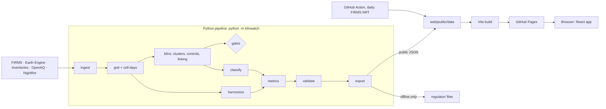

# Kiln Watch: Project Proposal

> **Post-build note (6 Oct 2026).** This document is a pre-build planning artifact (prior-work disclosure); its content is unchanged. In the built repository, `reports/` lives at `docs/reports/` and pitch material at `docs/presentation/`. See `file_structure.md` v3.1 for the as-built tree.

**A harmonized MODIS–VIIRS burning-activity calendar for Bangladesh that separates brick-kiln heat from vegetation fires**

| | |
|---|---|
| **Event** | NASA Space Apps Challenge 2026, 14–15 November 2026 |
| **Challenge** | *Harmonization of MODIS and VIIRS Hot Spots* (Earth Science · Software) |
| **Team** | _Team name and members to be added_ |
| **Version** | 3.0, 6 October 2026. Supersedes Proposal v2 (docx) and Upgrade Specification v3.0 |
| **Status** | Planning complete; no code written yet. Build follows [implementation_plan.md](implementation_plan.md). |
| **Related docs** | [architecture.md](architecture.md) · [implementation_plan.md](implementation_plan.md) · [file_structure.md](file_structure.md) · `Kiln_Watch_Flaw_Audit.txt` (47 findings, all addressed) |

---

## 1. Summary

NASA's two long active-fire records do not join cleanly. MODIS (1 km pixels, 2000–) and VIIRS (375 m pixels, 2012–) see fires differently. Simply joining them makes burning appear to jump in 2012 because the sensor changed, not because the fires did. This matters more every year: S-NPP VIIRS data delivery ends on 1 November 2026, and MODIS on Terra and Aqua is due to end in 2027.

In Bangladesh there is a second problem. Brick kilns fire through the same dry season (November–May) as crop-residue burning, so kiln heat is either counted as vegetation fire or thrown away.

**Kiln Watch fixes both:**

1. **Harmonization (the core).** Every sensor is converted to one unit, *Aqua-MODIS-equivalent cell-days per 1,000 cloud-free cells*:
   - The conversion is calibrated on the 2012–2021 overlap, anchored on Aqua (whose overpass time matches S-NPP).
   - It is chained forward to NOAA-20 and NOAA-21, so the record continues after S-NPP and MODIS end.
   - It is tested by leaving out one year at a time, and every value carries a 95% interval.
2. **Source separation.** A weakly supervised classifier labels each VIIRS detection as kiln-like, vegetation-like or unknown. It is trained on detections at mapped kiln clusters versus land-cover-matched control sites in the same season, and uses only physical and temporal features.
3. **A product people can use.** A static website shows a burning calendar for any district, upazila or drawn box from 2003 to today:
   - raw/harmonized toggle and the kiln/vegetation split
   - normal range, unusual days and critical periods
   - kiln-season history and a current-season tracker updated daily from FIRMS near-real-time data
   - the full scientific evidence

**Whether satellites can see kilns at all is unknown.** It is tested first, against rules written down and committed before anyone looks at the data. Every possible outcome still leaves a complete project.

---

## 2. Challenge fit

The challenge asks for a web application that harmonizes the split MODIS and VIIRS active-fire records into a burning-activity calendar. Its users are early-warning and emergency responders, scientists and land managers, who examine historical fire patterns, unusual conditions and critical periods for a selected area of interest.

> The challenge summary above is taken from public team repositories. Full statements are released on 28 October 2026; the title and objectives will be quoted verbatim in the README and this table re-checked.

| What the challenge asks for | How Kiln Watch answers it |
|---|---|
| Harmonize MODIS and VIIRS | A calibrated common unit (MYD-eq), a calibration chain through NOAA-20/21, leave-one-year-out testing and 95% intervals |
| Burning activity calendar | Year × day heatmap for any area, with a raw/harmonized toggle |
| Historical fire patterns | Season midpoint, duration and peak for every year since 2003, with intervals |
| Unusual conditions | Days above the 90th percentile of the area's normal range |
| Critical periods | Windows when the normal calendar is in its top quartile |
| Early warning | This season (NOAA-20/21 near-real-time) against the normal range, updated daily |
| Selected area of interest | District, upazila, or a box drawn on the map |
| *Our addition* | Every detection labelled kiln-like, vegetation-like or unknown |

**Positioning.** The brief is about wildfires and agricultural burns, and kilns are neither. So kilns are not the whole project: **the harmonized calendar is the core deliverable**, and kiln separation is what makes that calendar correct for Bangladesh.

---

## 3. The problem

### 3.1 The fire record breaks in 2012

| Fact | Detail |
|---|---|
| MODIS (Terra 2000–, Aqua 2002–) | About 1 km pixels; up to 4 looks a day; has a `type` field (0 vegetation, 1 volcano, 2 other static land source, 3 offshore) |
| VIIRS (S-NPP 2012–, NOAA-20, NOAA-21) | 375 m pixels; sees much smaller fires; one fire can produce several detections; no `type` field in near-real-time data |
| Size of the mismatch | In one agricultural-landscape study, VIIRS detected about 4.8× more fires than Terra + Aqua combined and about 6.5× more than Aqua alone, yet its mean per-fire power was lower (5.25 MW vs 16.10 MW), because it sees a population of small fires MODIS cannot |
| Sensor end-of-life | S-NPP data delivery ends 1 Nov 2026 (NOAA notice: 2 Nov). Terra MODIS is planned to end in Jan 2027 and Aqua around Sep 2027. Aqua has drifted since Jan 2022, and Terra left its constellation in Oct 2022. |
| Consequence | Any comparison of a future season with a year before 2012 needs harmonization. A simple union of the two records measures satellites, not fires. |

### 3.2 In Bangladesh, the calendar mixes two kinds of burning

Brick kilns fire continuously from roughly November to May, the same months as rice and wheat residue burning. If kiln heat is counted as vegetation fire, a burning calendar for the areas around Dhaka describes the wrong kind of burning. If FIRMS labels kilns as static sources (`type=2`), standard pipelines throw them away. The public 2026 projects for this challenge that we checked keep only `type=0` and do not mention kilns.

### 3.3 Why kilns matter

All figures are from Proposal v2's sources. Each must be traced to its primary source before it is used publicly; those marked *secondary* are currently cited through news or summaries.

| Figure | Source | Status |
|---|---|---|
| Kilns cause 30–50% of Bangladesh's PM2.5 emissions | 2016 Stanford project summary | Secondary; grant summary |
| Kilns cause 11% of national PM2.5 | Stanford-sponsored trial registration | Primary-ish |
| Up to 40% of Dhaka's winter PM2.5 | Stanford Woods Institute | Secondary |
| 58% of Dhaka's air pollution from nearby kilns | DoE, via Dhaka Tribune | Secondary (news) |
| About 7,000–7,500 kilns (DoE count) | Financial Express / The Business Standard | Secondary (news). This is a *registered* count, distinct from *detected* kilns |
| More than 7,000 predicted kiln locations | Lee et al. 2021, PNAS | Primary |
| More than three-quarters of kilns within 1 km of a school | Lee et al. 2021 (cite the paper, not the news article) | Primary |
| Over 18 million people within 1 km of a kiln | Eco-Business | Secondary |
| The Brick Kiln Act 2013 (amended 2019) bans kilns within 1 km of schools, hospitals and settlements | Act text | Primary |

**What is missing** is a consistent record of *when* kiln areas fire, how long their seasons last, and how that has changed since before the 2013 Act. That record cannot be built without harmonizing MODIS and VIIRS, because the Act came one year after VIIRS started.

---

## 4. Research question, hypothesis and expected finding

**Question.** Can industrial heat sources be separated from agricultural burning in a harmonized MODIS–VIIRS record? And what does that reveal about when Bangladesh's brick kilns fire, from 2003 to today?

**Hypothesis (untested).** A firing kiln presents a small, very hot area inside a 375 m pixel. Its combined radiant output may exceed the VIIRS detection threshold, especially at night. What matters is hot-area fraction × temperature, not temperature alone. No published method detects kilns thermally; all published kiln mapping uses optical imagery. So this is a genuine test, not an assumption.

**The finding we will report** takes one of two forms; both are results.

- **If kilns are visible:** "Bangladesh brick-kiln clusters are detected by VIIRS on X% (95% CI) of cloud-free firing-season nights, Y× the rate at land-cover-matched controls. Their signature is a months-long plateau, not a harvest spike. After harmonization and source separation, kiln heat is Z% of what FIRMS records as fire around Dhaka."
- **If they are not:** "Brick kilns are not reliably visible in MODIS/VIIRS active-fire data. Their detection rate is indistinguishable from matched cropland, and the radius sweep and detection-limit argument show why. Bangladesh's harmonized fire calendar is therefore a clean crop-burning record."

**One-line thesis:**

> "The satellite fire record misleads twice: a fake jump in 2012 when the sensor changed, and brick-kiln heat counted as fire. We fixed both, and we can prove it."

---

## 5. Proposed solution

### 5.1 Three layers

| Layer | What it delivers | Depends on |
|---|---|---|
| **1. Harmonized burning calendar (core)** | A calendar for any area, 2003–today; raw/harmonized toggle; normal range; unusual days; critical periods; season metrics with intervals; current season | Nothing; ships in every outcome |
| **2. Source separation** | Every VIIRS detection labelled kiln-like, vegetation-like or unknown; calendars stacked by label | Gate G1 (or GN for Nightfire) |
| **3. Kiln-area firing calendars** | Kiln-season length and midpoint per upazila across years, marked with the 2013 Act, the 2019 amendment and DoE drives; this season's kiln activity | G1; pre-2012 history only if G2 passes |

### 5.2 Who uses it, and what they decide differently

| User | Decision changed | Output |
|---|---|---|
| DoE enforcement teams | Which kiln clusters to inspect this week, ordered by current activity with uncertainty | Offline regulator export |
| Air-quality researchers | How much of a PM2.5 episode to attribute to kilns vs crop burning | Public calendars and downloads |
| Fire-data users and land managers in South Asia | Whether a trend is real or a sensor artefact | Harmonized calendar and normal range |
| Early-warning responders | Whether this season is above normal in their area | This-season page |
| Journalists and NGOs (the route to communities) | Reporting when the kiln season started in a district and how long it ran, in Bangla | District view, Bangla labels |

### 5.3 Responsible release (two tiers)

| Tier | Contents | Channel |
|---|---|---|
| **Public** | District and upazila calendars, kiln-like share, pooled cluster profiles, harmonized trends, all validation evidence | Website (GitHub Pages) |
| **Restricted** | Per-cluster leads with intervals, positional uncertainty, proximity to schools and hospitals (shown as separate components, never one score), OSM mapping completeness, candidate unmapped kilns | Offline export, handed directly to the regulator on request; **never hosted** |

The reason: a public per-site ranking of private businesses, built on a method still being validated and biased toward better-mapped urban areas, could harm kiln owners and workers. Code, a test and a CI check all block site-level fields from public files.

### 5.4 What we will not claim

1. That any kiln is operating illegally. Outputs are inspection leads.
2. That a kiln was off because there was no detection. We only say "no detection on N cloud-free days".
3. That detection counts are emissions. Any emissions figure is a labelled order-of-magnitude estimate.
4. That a satellite can see a licence, a kiln's technology or exact distances to schools.
5. That the calibration holds outside its training coverage (the 2012–2021 overlap, Bangladesh).
6. That the 2013 Act caused any change. Before/after comparisons are descriptive.
7. That thermal kiln detection is an established method. It is a hypothesis we tested, and the gate results are published.
8. Any pre-2012 kiln history, unless Gate G2 passes.

---

## 6. Method

### 6.1 Counting unit and cloud correction

- **Grid:** a 0.01° grid (about 1 km). A cell scores one *cell-day* per sensor and per overpass (day or night) if it has at least one detection. This absorbs most of the pixel-size difference, because one fire making several VIIRS detections usually falls in one cell.
- **Cloud-free denominators:** daily fire masks (MOD14A1, MYD14A1, VNP14A1, read through Google Earth Engine) record clear land and cloud separately. Activity rate = cell-days ÷ clear cells. A day is reported as *not observed*, never as zero, when under 20% of an area was clear.
- **Never pool raw counts across sensors.** Each sensor is normalised by its own observation opportunities. This also removes the effect of more satellites flying in later years.
- **Confidence:** the same rule for every sensor (keep nominal + high; MODIS 30–79 = nominal, ≥ 80 = high), with sensitivity runs at "all" and "high".
- **Positional uncertainty:** each detection's own pixel size (from its `scan` and `track` fields) sets its matching radius, because pixels grow away from the centre of the satellite's path.

### 6.2 Kiln geometry and matched controls

- **Kiln inventories:** Lee et al. 2021 (PNAS), APAD "IGP Brick Kilns Bangladesh" and SentinelKilnDB. They are cross-matched within 150 m and their agreement is reported. The primary list is chosen by a pre-registered rule: open licence, then vintage closest to 2018–19, then completeness.
- **Clusters:** DBSCAN groups kilns closer together than the measured VIIRS pixel size. **The cluster, not the kiln, is the unit.** Where kilns are closer than the positional error, per-kiln figures would be geometry, not data.
- **Matched controls:** each cluster gets 3 control sites with the same district, the same ESA WorldCover land-cover class, 5–10 km from any kiln, and an identical footprint shape. This is the key fix from the audit: random controls would let kilns "pass" simply because kilns sit where fields burn.

### 6.3 Feasibility gates (pre-registered)

These are tested on the 2018–19 season, matching the inventory date. **The rules are committed to `PREREGISTRATION.md` before any data is analysed.**

| Statistic | Meaning |
|---|---|
| DR | Clear-day detection rate (days with a detection ÷ clear days) |
| DR_night | DR using night detections only (kilns fire around the clock; crop burning is mostly daytime) |
| S | Season coverage: share of the 30 firing-season weeks with a detection (a plateau scores high) |
| P | Peak concentration: share of detections in the best 14 days (a harvest spike scores high) |
| M | Monsoon rate: DR in Jun–Oct, when kilns are shut. It is the false-positive baseline. |

**Gate G1 (VIIRS) passes only if all three hold:**
1. **Shape (primary):** kiln S ≥ 2 × control S, and kiln P < control P (Mann–Whitney p < 0.01).
2. **Contrast:** kiln DR ≥ 3 × control DR (permutation test within districts, p < 0.01).
3. **Seasonality:** firing-season DR ≥ 3 × monsoon DR.

| Gate | What it tests |
|---|---|
| G2 | Same rules for MODIS (2012–2019); decides whether a pre-2012 kiln history exists |
| G3 | Descriptive: how FIRMS labels kiln heat (`type` 0 or 2) |
| GN | Same rules using VIIRS Nightfire, the product built for industrial heat sources |

**What we build in each outcome:**

| Outcome | What we build |
|---|---|
| G1 ✅, G2 ✅ | Everything; kiln history from 2003 |
| G1 ✅, G2 ❌ | Everything; kiln layers from 2012 |
| G1 ❌, GN ✅ | Kiln layers powered by Nightfire |
| G1 ❌, GN ❌ | Kiln layers dropped; the negative result becomes a headline finding; source separation becomes harvest (Aman/Boro) vs other; harmonization unchanged |

The website reads the outcome from a single setting, so no code changes are needed after the decision.

### 6.4 Harmonization engine

- **Common unit:** Aqua-MODIS-equivalent ("MYD-eq") cell-days per 1,000 clear cells. Aqua is the anchor because its 13:30/01:30 overpasses nearly match S-NPP's, which separates the resolution effect from the time-of-day effect.
- **Calibration chain:** Aqua ↔ S-NPP on 2012–2021 (before Aqua's drift), then S-NPP ↔ NOAA-20 and NOAA-20 ↔ NOAA-21 on their overlaps.
  - Ratios are estimated per stratum: division × month × day/night × kiln-footprint/other.
  - Sparse strata are pooled to coarser strata by a fixed rule.
- **Models:** M0, a ratio estimator, is the default. M1, a Poisson GLM with month, region and scan-angle terms, ships only if it lowers the leave-one-year-out error by more than 10% (pre-registered).
- **Uncertainty:** a year-block bootstrap of the calibration, combined with Poisson count noise, gives 95% intervals on every value. **Leave-one-year-out** coverage must land between 90% and 97%.
- **Record:**
  - 2003–2011 is Aqua as observed.
  - 2012 onward is VIIRS converted to MYD-eq, with Aqua shown as an independent check line in the overlap.
  - After S-NPP ends, the chain runs from NOAA-20/21.
  - Drift-era MODIS is flagged and kept out of calibration.

### 6.5 Source classifier (weak supervision)

- **Labels:**
  - Positives: VIIRS detections inside kiln-cluster footprints in Nov–May, plus MODIS `type=2` detections at the same place and time where they exist.
  - Negatives: detections at matched control sites in the same months, plus far-from-kiln detections at half weight.
- **Leakage protection:** location, date and month are **not** features, and positives and negatives share the same season and land cover. The model must learn what kiln heat looks like, not where or when kilns are.
- **Features:** I4/I5 brightness temperatures and their difference, fire radiative power, day/night, scan, track, local hour, confidence, persistence (detections within 500 m over the previous 5 and 30 days), and isolation (neighbours in the same overpass; a spreading crop fire lights its neighbours, a kiln does not).
- **Model:** scikit-learn HistGradientBoosting (the XGBoost family), compared against a logistic regression and a simple rule (persistent + night).
- **Validation:** spatial holdout by district plus a temporal holdout on later seasons. Thresholds are chosen for ≥ 80% kiln-like precision and then frozen. If the model cannot beat the rule, the rule ships and we say so.
- **Candidate unmapped kilns:** persistent kiln-like heat more than 1 km from any mapped kiln, checked against SentinelKilnDB and by two independent raters on Sentinel-2 images. These go to the regulator export only.
- **Why a classifier at all:** the near-real-time VIIRS feed has no `type` field. And if FIRMS labels kilns `type=0`, the field cannot separate them anyway.

### 6.6 Products and metrics

- **Season metrics:** the midpoint (activity-weighted) and duration (10th–90th percentile of cumulative activity) are robust to detection rate, unlike first and last detection dates. First/last are shown only with a bias note. All carry intervals.
- **Normal range:** 10th/50th/90th percentile per day-of-year (±7 days) over 2003–2025. Unusual = above p90. Critical periods = top-quartile windows.
- **Harmonized Kiln Firing Index (HKFI):** daily kiln-like activity minus the monsoon baseline.
- **Season year:** July–June, so that one firing season is not split across two calendar years.

### 6.7 Validation, strongest first

| Rank | Evidence | What it shows |
|---|---|---|
| 1 | Shape + night contrast + monsoon baseline, over every season 2012–2025 | Kiln signal vs crop signal, without external data |
| 2 | SentinelKilnDB | Independent check of candidate unmapped kilns |
| 3 | Sentinel-2, two raters, written criterion (kiln structure + brick stacks or clay pits), top 25 + random 25 | Precision of candidates, and rater agreement (κ). Shows existence, not firing. |
| 4 | TROPOMI NO2/SO2, kiln belts vs nearby non-kiln rings, firing vs monsoon (difference-in-differences) | An emissions signal independent of the thermal method |
| 5 | Dhaka PM2.5 (OpenAQ) vs kiln and vegetation indices at 0–2 day lags, controlling for weather (ERA5-Land) | The impact chain. Correlational and caveated. |
| 6 | DoE closure cases | Qualitative illustration only, not a test |
| 7 | Transfer test: the frozen model run on one held-out Indo-Gangetic Plain district | Whether the method generalises (no retraining) |

---

## 7. Data

| Dataset | Used for | Access |
|---|---|---|
| NASA FIRMS MODIS C6.1 (Terra, Aqua), standard archive | Detections 2003–; `type` field | FIRMS archive download / Area API |
| NASA FIRMS VIIRS 375 m: S-NPP, NOAA-20 (standard), NOAA-21 (near-real-time) | Detections 2012– | FIRMS archive / Area API |
| FIRMS near-real-time (NOAA-20, NOAA-21) | Current-season tracker | Area API, `FIRMS_MAP_KEY` |
| MOD14A1, MYD14A1, VNP14A1 daily fire masks | Cloud-free denominators | Google Earth Engine |
| VJ114A1 / VJ214A1 | Denominators after S-NPP ends | NASA Earthdata (earthaccess) |
| Sentinel-5P TROPOMI NO2, SO2 | Validation layer 4 | Google Earth Engine |
| ESA WorldCover 10 m | Control matching | Google Earth Engine |
| ERA5-Land daily | Weather controls for PM2.5 | Google Earth Engine |
| Sentinel-2 SR | Rater image chips | Google Earth Engine |
| Lee et al. 2021 kiln locations | Kiln inventory (primary candidate) | Paper data release (availability to confirm) |
| APAD IGP Brick Kilns (Bangladesh + transfer region) | Kiln inventory; transfer test | AWS Open Data, CC BY 4.0 |
| SentinelKilnDB (NeurIPS 2025, about 62,700 South Asian kilns) | Newer inventory; validation | Public release |
| HDX Bangladesh boundaries (district, upazila) | Areas of interest | HDX |
| EOG VIIRS Nightfire | Gate GN | EOG (registration) |
| OpenAQ (US Embassy Dhaka; DoE stations where listed) | Validation layer 5 | OpenAQ v3 API |
| OSM schools/hospitals + BANBEIS school counts | Regulator proximity components and OSM completeness | Geofabrik; BANBEIS |
| Crop calendars, policy events | Harvest shading; timeline markers | Hand-built, each row cited |

Every dataset is credited on the website's Method page and in the README. APAD's CC BY 4.0 attribution is included.

---

## 8. System architecture

- **No server at runtime.** Everything is precomputed into static JSON and served by GitHub Pages, so there is no cold-start delay and the site works offline.
- **Daily update.** A GitHub Action fetches FIRMS near-real-time data, labels it with the frozen classifier, converts it with the frozen calibration, and redeploys. Cloud-free denominators for the current season are provisional (based on climatology) and are labelled as such.
- **One contract.** The pipeline and the website meet only at `web/public/data/`, whose shapes are fixed by `web/src/lib/types.ts`.

### 8.1 Tech stack

| Layer | Technology |
|---|---|
| Pipeline | Python 3.11, pandas, NumPy, PyArrow (Parquet), GeoPandas, Shapely |
| Satellite processing | Google Earth Engine Python API; earthaccess |
| ML / statistics | scikit-learn (DBSCAN, BallTree, HistGradientBoosting, PoissonRegressor), SciPy |
| Figures | Matplotlib |
| Frontend | React 19 + TypeScript, Vite, Tailwind CSS v4, react-router (`HashRouter`), Leaflet + react-leaflet, Apache ECharts |
| Hosting / CI | GitHub Pages; GitHub Actions (`ci.yml` for tests/build, `deploy.yml` for the daily update + deploy) |
| Quality | pytest, Ruff, Vitest, ESLint, TypeScript checks, one Playwright smoke test |

### 8.2 The website

| Page | What it shows |
|---|---|
| **Story** | The headline finding; the "2012 jump" chart (raw vs harmonized with interval band and Aqua check line); the plateau-vs-spike chart (kiln clusters vs matched controls, with harvest windows) |
| **Explorer** | Map + search for district/upazila or a drawn box; year × day calendar (raw/harmonized, kiln/vegetation/unknown); normal range with unusual days and critical periods; season metrics; CSV/JSON download |
| **Kiln seasons** | Kiln-season length per upazila per year, with the 2013 Act, the 2019 amendment and DoE drives marked |
| **This season** | Season-to-date against the normal range, labelled provisional, updated daily |
| **Evidence** | Gate results beside the pre-registered rules; radius sweep; night contrast; calibration test table; classifier performance; candidate precision; TROPOMI; PM2.5; transfer test |
| **Method & limits** | Non-claims, release policy, data credits, method note, links to the pre-registration and code |

Every view is deep-linkable. Every chart has a plain-language summary sentence. The palette is colour-blind-safe and also uses patterns. A Bangla interface is planned (Could tier).

---

## 9. The current build

### 9.1 Decisions log

| Decision | Choice | Why |
|---|---|---|
| Core vs application | Harmonization is the core; kilns are the local application | Fixes Relevance; a kiln failure costs the framing, not the project |
| Architecture | Precomputed static site, no backend | No cold starts; works offline; reproducible |
| Frontend | React + TypeScript + Vite + Tailwind | Components, typed data contract, fast styling |
| Satellite processing | Google Earth Engine | No multi-GB downloads |
| Classifier labels | Kiln footprint + season, plus MODIS `type=2` where present | Works whatever Gate G3 finds |
| Regulator tier | Offline export only | Real access control; no attack surface |
| Nightfire | Gate track only | Enters the product only if it beats FIRMS |
| Geography | Bangladesh + one held-out transfer district | Turns "scalable" into a measured claim |
| Pre-event work | The team chose to build the full system before the event | Must be disclosed and confirmed (see §9.5) |

### 9.2 Build order

The full plan is in [implementation_plan.md](implementation_plan.md) §10.

| Track | Steps |
|---|---|
| **Setup** | S0 accounts + data requests · S1 repo, CI and a working Pages deploy · S2 pre-registration commit · S3 data contract + sample data (unblocks the web track) |
| **Pipeline** | A1 ingest · A2 grid · A3 Earth Engine denominators · A4 kiln geometry · **A5 gates (decision point)** · A6 harmonization · A7 classifier · A8 metrics · A9 validation · A10 export · A11 daily update |
| **Website** | B1 foundations · B2 Story · B3 Explorer · B4 Evidence + Method · B5 Kiln seasons + This season · B6 drawn box · B7 quality pass. Built against sample data in parallel with the pipeline. |
| **Integration** | I1 real-data swap · I2 go live · I3 clean-clone reproduction · I4 offline check |

### 9.3 Scope tiers

| Tier | Contents |
|---|---|
| **Must** | Harmonized calendar, gates, classifier (or the rule fallback), metrics, validation layers 1, 3 and 4, public site (Story, Explorer, Evidence, Method), daily update, regulator export, tests, reproducibility |
| **Should** | Nightfire gate, SentinelKilnDB and PM2.5 validation, candidate unmapped kilns, transfer test, drawn box, Kiln seasons and This season pages, GLM calibration, smoke test |
| **Could** | Bangla interface, emissions estimate, OSM proximity in the regulator export, closure-case panel |

### 9.4 Definition of done

- Every challenge requirement is visible on the deployed site.
- The gate report evaluates every pre-registered rule, and the outcome is recorded.
- Calibration leave-one-year-out coverage is 90–97%, and the 2012 seam is gone.
- The classifier beats both prevalence and the rule baseline in both holdouts, or the rule ships and this is stated.
- The daily update is green 3 days running.
- All tests and the public-safety check pass.
- A clean clone reproduces the headline numbers.
- The site works offline.

### 9.5 Open items to resolve before or during the build

| # | Item | How it gets resolved |
|---|---|---|
| 1 | Is the Lee et al. kiln dataset downloadable? | Check the paper's data release; otherwise APAD becomes primary by rule |
| 2 | Does the VIIRS standard archive carry a `type` column? | Inspect the downloaded files (step A1) |
| 3 | Earth Engine band names and VNP14A1 end date | Verify in step A3 |
| 4 | Exact FIRMS start dates for NOAA-20 and NOAA-21 | Read from the downloaded data |
| 5 | Are there Bangla names in the HDX boundaries? | Check in A1; otherwise a small hand-made district table |
| 6 | OpenAQ coverage for Dhaka | Check in A9; restrict to complete periods |
| 7 | SentinelKilnDB coverage and date for Bangladesh | Check at download |
| 8 | Which transfer district (India or Pakistan) | Pick one with an open inventory and similar kiln density |
| 9 | 2026 rules on work done before the event | Read the 2026 guide; confirm with the Dhaka Local Lead; disclose all prior work in References; keep the git history public |
| 10 | The official challenge statement | Re-check the §2 table on release; adjust within the Must tier |
| 11 | Team name, members and roles | Fill in the header |
| 12 | Primary sources for the impact figures in §3.3 | Replace the secondary citations before anything public |

---

## 10. What is new (novelty)

**What already exists:**
- Optical deep-learning kiln mapping (Lee et al. 2021; SentinelKilnDB 2025)
- Automated compliance and proximity checks (arXiv 2406.10723, 2412.04065)
- Several 2026 Space Apps projects building fire calendars, none separating kiln heat (checked 5 Oct 2026)

**What Kiln Watch adds:**
1. **The time axis:** *when* kilns fire, season by season, rather than *where* they are.
2. **A validated calibration chain** that survives the end of S-NPP and MODIS, with tested uncertainty.
3. **Source separation for VIIRS**, which has no usable `type` field in near-real-time data, through weak supervision.
4. **A pre-registered test** of whether thermal satellites can see kilns at all. It is publishable whichever way it comes out.

---

## 11. How this scores with judges

| Criterion | What we show |
|---|---|
| **Impact** | Corrected fire calendars for one of the most kiln-dense countries; a regulator use path; a transfer test showing reach across the Indo-Gangetic Plain |
| **Creativity** | The first separation of industrial heat from vegetation fire in a harmonized MODIS–VIIRS record; weak supervision; the time axis |
| **Validity** | Pre-registered gates, matched controls, monsoon baseline, radius sweep, day/night split, held-out calibration testing with interval coverage, spatial and temporal holdouts, independent validation, written non-claims |
| **Relevance** | Every element of the brief mapped to a feature; harmonization is the technical core |
| **Presentation** | One thesis, two clear charts, an instant-loading deep-linkable site |

**Awards in reach:** Best Use of Science, Best Use of Data, and Local/Galactic Impact.

---

## 12. Risks

| Risk | Likelihood | Impact | Mitigation |
|---|---|---|---|
| VIIRS cannot see kilns | Medium | High | Pre-registered branches; Nightfire track; the harmonization core is unaffected |
| MODIS cannot see kilns | High | Medium | Kiln history from 2012 only |
| FIRMS archive delivery delayed | Medium | High | FIRMS API backfill |
| Earth Engine quota or timeouts | Medium | High | Monthly chunks, resumable cache, batch-export fallback |
| Classifier learns location instead of physics | Medium | High | Location/date excluded; spatial + temporal holdouts; tests |
| Classifier no better than a simple rule | Medium | Medium | Ship the rule and say so |
| TROPOMI or PM2.5 show nothing | Medium | Low | Ranked below stronger evidence; reported honestly |
| Pipeline and website drift apart | Medium | High | Frozen data contract, contract tests, shared sample data |
| S-NPP stops and the daily update breaks | Medium | Medium | Empty-feed handling; NOAA-20/21 chain |
| Site-level data leaks into public files | Low | High | Code guard, test and CI check; regulator files never committed |
| OSM mapping bias toward cities | High | Medium | Proximity in the regulator export only, with per-district completeness |
| Pre-event build questioned under the rules | Low–Medium | High | Disclosure, public history, Local Lead confirmation |

---

## 13. Known limitations

| Limitation | Effect |
|---|---|
| Daily cloud masks merge all of a day's overpasses | Night-only rates use a day+night cloud denominator |
| NOAA-20/21 use the S-NPP cloud mask until S-NPP ends | Small denominator error, which we measure on one month |
| Current-season denominators are climatological | The current season is labelled provisional |
| Drawn-box areas use district-level cloud data | Box results are approximate and show total burning only |
| No boundary-layer height in the PM2.5 model | Some residual weather confounding |
| Kiln inventory from 2018–19 | Newer kilns missing; unmapped kilns in controls make results conservative |
| Kiln technology (FCK vs zigzag) not distinguished | Detectability may differ by technology; not claimed |

---

## 14. Future work

- **A bounded emissions estimate:** activity-weighted kiln-days × published emission factors, Bangladesh first, labelled order-of-magnitude. The global framing stays here as future work until this is delivered.
- Indo-Gangetic Plain coverage (India, Pakistan, Nepal) using SentinelKilnDB, if the transfer test holds.
- Pass-specific cloud masks from swath products.
- A service-account Earth Engine update so current-season denominators stop being provisional.
- A regulator-requested delivery channel, once the DoE states its preference.

---

## 15. Repository and commands

| Path | Contents |
|---|---|
| `kilnwatch/` | Python pipeline (one module per stage) |
| `web/` | React website; `web/public/data/` holds the generated public data |
| `tests/` | pytest suite, including contract and public-safety tests |
| `data/static/`, `data/models/`, `data/nrt/` | Committed small inputs, frozen models, current-season data |
| `reports/` | Generated evidence: gate, harmonization, classifier and validation reports with figures |
| `regulator/` | Offline restricted export (never committed) |
| `PREREGISTRATION.md` | Gate rules, committed before analysis |

| Task | Command |
|---|---|
| Run the pipeline | `python -m kilnwatch all` (Earth Engine step: `python -m kilnwatch gee`) |
| Sample data for website work | `python -m kilnwatch export --fixtures` |
| Website dev server | `cd web && npm install && npm run dev` |
| Build + offline preview | `npm run build && npm run preview` |
| Tests | `pytest -q` · `npm test` |
| Regulator export | `python -m kilnwatch export --regulator` |

Full detail is in [file_structure.md](file_structure.md).

---

## 16. Glossary

| Term | Meaning |
|---|---|
| Active fire / hotspot / detection | A satellite pixel flagged as containing a heat source hotter than its surroundings |
| SP / NRT | FIRMS *standard processing* (archive, quality-checked, has `type` for MODIS) vs *near-real-time* (fast, no `type`) |
| Cell / cell-day | A 0.01° grid cell; one cell-day = that cell had ≥ 1 detection on that day, per sensor and pass |
| Clear cells / denominator | Cells observed without cloud that day, from the daily fire masks |
| MYD-eq | Aqua-MODIS-equivalent cell-days per 1,000 clear cells: the harmonized unit |
| β / calibration chain | The conversion factor between two sensors; chained Aqua ← S-NPP ← NOAA-20 ← NOAA-21 |
| LOYO | Leave-one-year-out: calibrate without a year, predict it, check the error and interval coverage |
| Bootstrap interval | An uncertainty range from resampling the data many times |
| Kiln cluster / footprint | Kilns grouped by DBSCAN closer than a VIIRS pixel; the footprint is the area around them |
| Matched control | A non-kiln site with the same district, land cover and footprint, 5–10 km from any kiln |
| DR, S, P, M | Detection rate, season coverage, peak concentration and monsoon rate (see §6.3) |
| Gate / pre-registration | A pass/fail test whose rules were committed before seeing the data |
| GATE_BRANCH | The one setting that records the gate outcome and switches the product accordingly |
| Weak supervision | Training with noisy labels derived from rules (location + season) rather than hand labels |
| HKFI | Harmonized Kiln Firing Index: kiln-like activity minus the monsoon baseline |
| Season year | 1 July – 30 June, so that a Nov–May firing season stays in one year |
| Provisional | Current-season values whose cloud correction uses climatology, not observed masks |
| Upazila / district / division | Bangladesh's sub-district, district (64) and division (8) administrative levels |
| IGP | Indo-Gangetic Plain: the kiln-dense region across Pakistan, India, Nepal and Bangladesh |
| FCK / zigzag | The two main kiln technologies in Bangladesh (Fixed Chimney Kiln; the cleaner zigzag kiln) |
| Regulator export | Restricted per-cluster lead files generated offline for the DoE; never hosted |

---

## 17. References

**Challenge and event**
- Harmonization of MODIS and VIIRS Hot Spots: https://www.spaceappschallenge.org/2026/challenges/harmonization-of-modis-and-viirs-hot-spots/
- Space Apps 2026 event dates: https://www.spaceappschallenge.org/blog/explore-the-next-frontier-at-the-2026-nasa-space-apps-challenge/
- Judging and awards guide: https://www.spaceappschallenge.org/resources/judging-awards-guide/
- Project submission guide: https://spaceappschallenge.org/resources/project-submission-guide

**Satellites, FIRMS and products**
- FIRMS attribute definitions (Type, scan, track, confidence, day/night): https://www.earthdata.nasa.gov/data/tools/firms/active-fire-data-attributes-modis-viirs
- FIRMS Area API: https://firms.modaps.eosdis.nasa.gov/api/area/
- VIIRS 375 m active fire product; S-NPP delivery end: https://www.earthdata.nasa.gov/data/instruments/viirs/viirs-i-band-375-m-active-fire-data
- NOAA notice on S-NPP cessation: https://www.nesdis.noaa.gov/news/cessation-of-suomi-national-polar-orbiting-partnership-s-npp-data-users-onafter-november-2-2026
- MODIS end dates (Copernicus CAMS): https://atmosphere.copernicus.eu/drifting-away-modis-cams-global-fire-assimilation-system
- MODIS → VIIRS transition (NASA Earthdata): https://www.earthdata.nasa.gov/data/alerts-outages/transition-from-modis-viirs
- Schroeder et al. 2014, VIIRS 375 m algorithm: https://www.earthdata.nasa.gov/sites/default/files/imported/Schroeder_et_al_2014b_RSE.pdf
- MODIS vs VIIRS in an agricultural landscape (4.8×/6.5×, FRP figures): https://pmc.ncbi.nlm.nih.gov/articles/PMC6108185/
- MODIS science team on harmonizing the records: https://modis.gsfc.nasa.gov/sci_team/meetings/202305/presentations/boschetti.pdf
- Aqua MODIS ↔ S-NPP VIIRS continuity: https://www.star.nesdis.noaa.gov/JPSS/documents/meetings/2012/AMS_NewOrleans_2012/Oral/2012_AMS_Csiszar_Fire_V1.pdf
- FIRMS Static Thermal Anomalies mask: https://www.earthdata.nasa.gov/news/blog/firms-releases-new-features-identify-active-fires-type
- VIIRS Nightfire: https://www.mdpi.com/2072-4292/5/9/4423 · https://www.sciencedirect.com/science/article/abs/pii/S0034425717304820
- DBSCAN settings for VIIRS hotspots (Chansury et al. 2024): https://doi.org/10.1109/GIS-IDEAS63212.2024.10991155
- Earth Engine catalog (VIIRS, MODIS, Sentinel-5P): https://developers.google.com/earth-engine/datasets/tags/viirs · https://developers.google.com/earth-engine/datasets/catalog/modis · https://developers.google.com/earth-engine/datasets/catalog/COPERNICUS_S5P_OFFL_L3_NO2

**Kilns and Bangladesh**
- Lee et al. 2021, PNAS (kiln locations, proximity to schools): https://www.pnas.org/doi/10.1073/pnas.2018863118
- APAD IGP Brick Kilns Bangladesh: https://registry.opendata.aws/asset-data-igp-brick-kilns-ban/
- SentinelKilnDB (NeurIPS 2025): https://neurips.cc/virtual/2025/poster/121530
- Optical kiln detection and compliance monitoring: https://arxiv.org/html/2406.10723v1 · https://arxiv.org/html/2412.04065v3 · https://www.nature.com/articles/s41597-025-05148-9
- Kiln firing season (J-PAL): https://www.povertyactionlab.org/print/pdf/node/8036722
- Stanford 30–50% PM2.5 summary: https://woods.stanford.edu/research/funding-opportunities/environmental-venture-projects/assessing-brick-kilns-number-location-and-use-bangladesh
- 11% national PM2.5 (trial registration): https://www.isrctn.com/ISRCTN15354089
- Up to 40% of Dhaka winter PM2.5: https://woods.stanford.edu/20x20-reducing-health-impacts-brick-kilns
- DoE 58% figure (Dhaka Tribune): https://www.dhakatribune.com/bangladesh/195700/improving-air-quality-in-dhaka-bangladesh-cracks
- DoE kiln count and demolition drives: https://old.thefinancialexpress.com.bd/national/700-illegal-brickfields-to-be-demolished-to-check-air-pollution-1610427426
- Regional crop-residue burning and air quality: https://iopscience.iop.org/article/10.1088/1748-9326/ad4a90 · https://www.sciencedirect.com/science/article/abs/pii/S0269749124007279

**Other 2026 projects checked (5 Oct 2026)**
- https://github.com/kishorkishor/NASA_PROJECT · https://github.com/shahriyarcse-arch/BD_FireOps---Nasa-Space-Apps-Challange · https://github.com/samuelakosaonyejekwe/firecal · https://github.com/aroyy007/Fire-Season · https://github.com/ehasanulhaque152/EarthFire

---

## Appendix A: Changes from Proposal v2

| Area | Proposal v2 | This proposal |
|---|---|---|
| Harmonization | A simple ratio, one paragraph | An Aqua-anchored calibration chain through NOAA-21, per-stratum ratios, GLM candidate, LOYO coverage target |
| Controls | Random points with similar land cover, ≥ 5 km away | Matched on district + WorldCover class, 5–10 km, identical footprint |
| Gate rule | Threshold "fixed before running" | Written rules: shape (primary) + contrast + seasonality, with statistical tests, committed first |
| Labels | Distance + season + type + STA mask rules | A weak-supervision classifier with leakage controls and holdouts; rules kept as the baseline |
| Nightfire | Missing | A parallel gate (GN) |
| Validation | Seasonality, controls, Sentinel-2, closure cases | A ranked ladder: shape/night/monsoon, SentinelKilnDB, two-rater Sentinel-2, TROPOMI, PM2.5, transfer test; closure cases demoted to illustration |
| Site-level output | Per-kiln calendars and proximity flags | Clusters only; site-level leads only in the offline regulator export |
| Statistics | First/last active dates | Robust midpoint and duration with intervals; first/last with a bias note |
| Architecture | Static site described in one paragraph | A full architecture, typed data contract, React app, CI/CD, daily update and tests |
| Scope | Must/Should/Could lists | Ordered build steps with verification, scope tiers and a definition of done |
